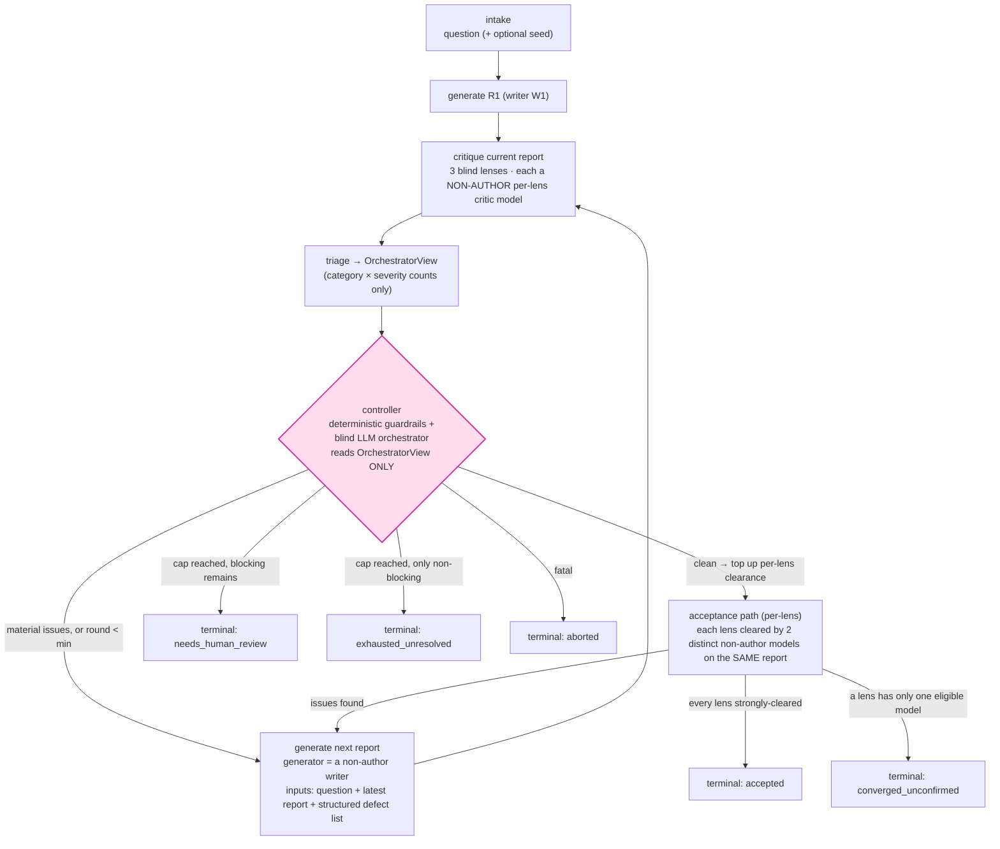

# reasonable-answer — Design Overview

> **Status:** design documentation only (v3). No code yet. This document set describes the
> principles and structure a future build should implement. v3 incorporates four rounds of
> adversarial design review (Codex) and the resulting design decisions — see
> [decisions.md](./decisions.md).

## What it is

A system that takes **a question and/or a seed artifact** (a report, a news article, an
existing draft) and produces a **higher-quality report** whose argument is *sound*.

"Sound" is operationalized, not asserted: a role-structured roster — writers plus per-lens critic
models, none reviewing its own draft — drives the report to a state where **no** eligible reviewer
can find a material defect (fabricated citations, contradictions, unsupported claims,
misrepresented sources, missing counterarguments). What remains is only cosmetic nitpicking — at
which point we stop.

Speed is an explicit **anti-goal**. The intended runtime is a Mac Studio running GLM 5.2
locally: high quality, abysmal token rate. Resumability and a full audit trail matter far
more than latency.

## Core loop: an alternating refine game with a blind referee

The heart of the system is an alternating game: models take turns **writing** and **critiquing** a
report, and a report is always critiqued by models that did **not** author it. The system is
**role-structured** — a writer pool plus **per-lens critic models** (the table below shows one tick
per row):

| tick | report | writer | logic critic | evidence critic | completeness critic |
|------|--------|--------|--------------|-----------------|---------------------|
| 1 | R1 | W1 | La | **Scout** | Ca |
| 2 | R2 | W2 | Lb | **Scout** | Cb |
| 3 | R3 | W1 | La | **Scout** | Ca |

Each report has one **writer** (from the writer pool) and **three per-lens critic models**, none of
which may be the writer of *that* report. A model can be a **critic-only specialist** — e.g. Llama 4
Scout, pinned to the evidence lens, never a writer — so it can review every tick without ever
violating author-exclusion. For a strong `accepted`, each lens pool holds **≥2 eligible non-author
models** so every dimension gets a second, distinct reviewer (see D15/D16 in
[decisions.md](./decisions.md) and [architecture.md](./architecture.md)).

Invariants that make this work:

- **Every per-lens critic of `Rₙ` ≠ the writer of `Rₙ`** — no model ever critiques its own draft,
  on any lens (principle 7, for free).
- **`writer(Rₙ₊₁) ∈ writer_pool \ {writer(Rₙ)}`** — the next report is written by a different model
  than the last, improving a draft it did not author. There is no peer opinion to defer to, so the
  revision step is structurally sycophancy-resistant.
- **The handoff is a structured defect list, not raw critique prose.** The critique is triaged
  into objective fix-tasks (`{locus, observable-category, severity, instruction}`). This keeps
  principle 1 (artifact-first) and principle 6 (fresh context) fully intact — the generator
  receives the report plus an objective task list, never reasoning or verdicts.
- **Convergence is temporal** — agreement emerges when the alternating critique stream dries
  up, not from simultaneous voting. This dissolves the corroboration-vs-specialization
  conflict raised in review (a logic critic and an evidence critic can't corroborate each
  other; here they don't need to).

A **blind referee** (the orchestrator) watches only a content-free *OrchestratorView* — category
× severity counts — and decides continue / finalize / abort. It never sees the report.

## The problem it solves

Ask AIs to critique each other naively and they fail two ways: **sycophancy** (an agent that
sees a prior verdict drifts toward it) and the **nitpick spiral** (agents surface ever-smaller
objections and never agree it's finished). The through-line: LLM judgment degrades when social
dynamics, accumulated context, or prior reasoning pollute an independent judgment.

The design's answer: the agents supply judgment; a **blind, guardrailed controller** supplies
the *stopping rule they lack*. Convergence is decided by the referee, using signals the players
can't game because none can see the whole board.

## The isolation principles → how they are enforced

| # | Principle | Enforcement in this design |
|---|-----------|-----------------------------|
| 1 | Artifact-first handoffs | Held: only the report + a structured, depersonalized defect list pass forward — objective fix-tasks, never reasoning or verdicts. See [decisions.md](./decisions.md). |
| 2 | Social isolation | The 3 lenses run as separate fresh contexts, blind to each other. Critics never see prior critiques. |
| 3 | Authorship blindness | No critic is told who produced the report it evaluates. |
| 4 | Focused, role-scoped prompts | Each lens gets one job (logic / evidence / completeness), not "review everything." |
| 5 | Refinement over debate | Each tick improves the report; models never argue with each other. |
| 6 | Fresh context per agent | Generator sees only {question, latest report, defect list}; critics see only {question, report, lens}. No history accumulation. |
| 7 | Production ≠ review | Guaranteed by `critic(Rₙ) ≠ generator(Rₙ)`. |

## Toolchain (chosen, with precedent)

- **Python + LangGraph** for the stateful loop; **LiteLLM proxy** (one OpenAI-compatible
  endpoint) for *all* models — cloud today, the local GLM 5.2 box is just another roster entry.
- Modeled on the sibling project `~/code/hide-my-list` (Python + LangGraph + LiteLLM proxy).

> **Critical caveat:** LangGraph state is *shared* across nodes, so isolation is not automatic.
> The orchestrator's blindness is made **structural**: it is invoked with an `OrchestratorView`
> DTO only (bounded counts, no ids/hashes/content), produced by a projection outside any node —
> artifact-bearing state never reaches it.
> See [isolation.md](./isolation.md) and RA-002 in [decisions.md](./decisions.md).

## Document map

- **[architecture.md](./architecture.md)** — the LangGraph graph, node roles, writer/critic
  role-assignment, structural isolation, failure handling, versioning, sequence diagram.
- **[isolation.md](./isolation.md)** — what each agent sees / never sees; the structural
  boundary; the "own-critique" anti-sycophancy property; the prompt-injection threat model.
- **[convergence.md](./convergence.md)** — the observable-category taxonomy, the OrchestratorView
  schema, the ordered stop-decision (guaranteed to terminate), and terminal statuses.
- **[decisions.md](./decisions.md)** — design decisions, the Codex review, and how each of the
  20 findings was resolved.
