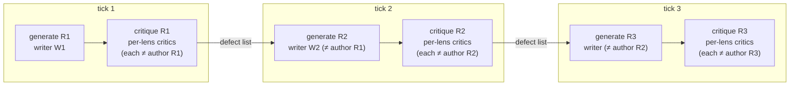
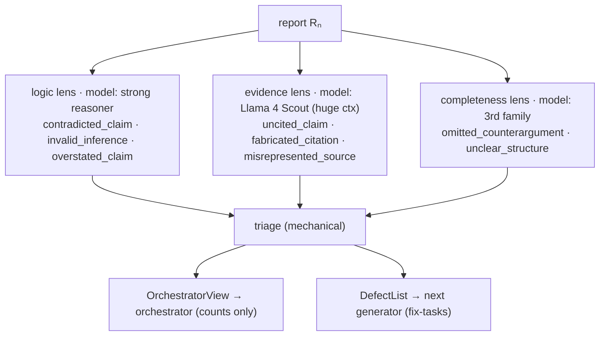
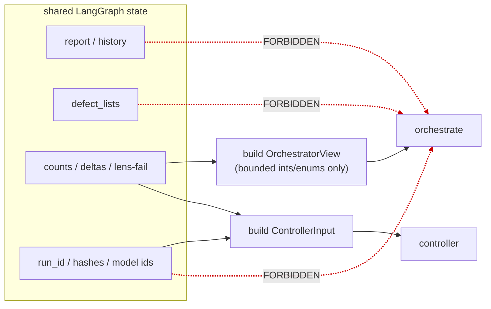
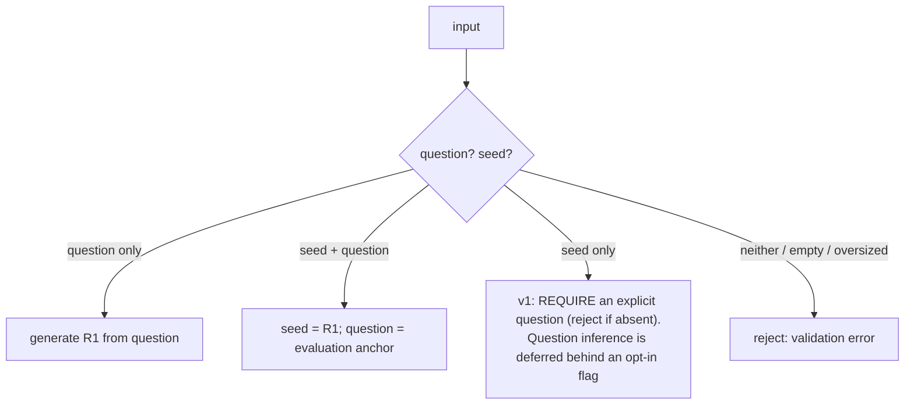

# Architecture — the LangGraph graph (v3)

## Roster structure & role assignment (D15, D16)

The roster is **role-structured**, not a flat swap:

- **Writer pool** — models that author reports (round-robin as generators).
- **Per-lens critic pools** — each lens (logic / evidence / completeness) has its own set of
  eligible models, which may include **pinned specialists** (e.g. Llama 4 Scout as a dedicated
  evidence reviewer). Models may be **critic-only** (never author), which cleanly satisfies the
  author-exclusion rule.

The one hard invariant: **a report is never critiqued — on any lens — by the model that authored
it.** With disjoint writer/critic pools this holds automatically; with overlap it is enforced per
tick. For a strong `accepted`, each lens pool must contain **≥2 eligible non-author models** so the
dimension can be independently double-checked (see Acceptance in
[convergence.md](./convergence.md)); a lens with only one eligible model degrades that dimension to
`converged_unconfirmed`.

The diagram below shows a minimal roster for clarity; generator selection is round-robin among
writers excluding the current artifact's author, preserving `critic(Rₙ) ≠ generator(Rₙ)`.



Each `critique` box is three per-lens critic models (logic / evidence / completeness), each a
fresh blind context and each excluded if it authored the report under review. Writers rotate; a
model may be a critic-only specialist (never a writer).

Invariants (enforced in code, covered by tests):
- `critic(Rₙ) ≠ generator(Rₙ)` — production ≠ review (holds for confirmation critiques too).
- `generator(Rₙ₊₁) ∈ writer_pool \ {author(Rₙ)}` — a writer, never the author, never a critic-only specialist.
- Models distinct at the **resolved** provider/model/version level, not just the alias (RA-017);
  prefer distinct providers/families per lens and **warn** when a lens's two critic models share a family (weak independence).

## Nodes and responsibilities

| Node | Reads | Produces | Model | Trust model |
|------|-------|----------|-------|-------------|
| **intake** | raw input | normalized `question` / `seed`; routing | none | deterministic |
| **generate** | question + latest report + **defect list** | next report (with citations) | non-author (alternating) | LLM (untrusted output) |
| **critique** | report + question + **one lens** + taxonomy | `Issue[]` per lens | per-lens non-author model | LLM (untrusted output) |
| **triage** | this tick's `Issue[]` | `OrchestratorView` + `DefectList` | none — **mechanical** | deterministic |
| **orchestrate** | `OrchestratorView` **only** | recommendation (minor-polish judgment) | LLM, blind | LLM inside guardrails |
| **controller** | `ControllerInput` | decision + terminal status | none | **deterministic — owns termination** |
| **finalize** | best report + history | final report + terminal status + audit trail | none | deterministic |

> **Trust model (RA-020, RB-004):** the orchestrator is a *blind LLM* whose authority is limited to
> the minor-polish judgment; the **deterministic controller** owns every hard transition and
> termination. See the ordered decision table in [convergence.md](./convergence.md).

## The 3 lenses (per-lens critic models, three fresh contexts)

Each lens is assigned its own critic model (D15) — pick the best tool per dimension. The only hard
rule is that a lens's model must **not** be the author of the artifact under review.



Each lens runs on its assigned critic model, in a **fresh context**, blind to the others. They
emit `Issue[]` against a closed schema.

## The DefectList — enough to actually fix a blocking issue (RB-005)

`{locus, category, severity, instruction}` alone cannot convey *which* two propositions
contradict, or *what* source/claim mismatch was seen — so a blocking defect could survive even
though the critic found it. The schema therefore carries **bounded, evidence-bearing fields**,
treated as untrusted data (length/format validated):

```
Defect {
  locus: StructuralRef            # section/paragraph index — NOT free text (RB-007)
  category: <closed enum>
  severity: <clamped to floor>    # RB-006
  claim_span: quoted, length-limited        # the offending claim (untrusted)
  related_span: quoted, length-limited      # e.g. the contradicting claim / cited passage
  citation_id: opt                # for citation categories
  expected_support: opt, bounded  # what the citation would need to show
  rationale: bounded (≤ N chars)  # concise, objective, no verdict language
  instruction: bounded            # concrete fix
}
```

Critic **provenance** (which lens/model raised it) is retained in the audit store but **not** in
the generator-facing form (authorship blindness, principle 3).

## Failure & invalid-output handling — fail closed (RA-007, RB-007)

No failure or invalid output can manufacture a clean review. The earlier contradiction ("repair →
failed lens" vs. "unknown categories dropped") is resolved **in favor of fail-closed**:

| Failure | Behavior |
|---------|----------|
| Unknown enum / invalid or over-length field in any issue | **fails the entire lens** — never silently dropped |
| Malformed / schema-violating critic output | up to *R* bounded repair retries; then lens **failed** |
| Any **failed lens** in a tick | `lenses_failed > 0` ⇒ review incomplete ⇒ controller rule 2 (re-critique); budget exhausted ⇒ rule 3 `fatal` → `aborted` |
| Per-call timeout | retry within budget; exhausted ⇒ `fatal` |
| Empty `Issue[]` | counts as clean **only if** all lenses completed successfully |
| Generator failure | retry within budget; exhausted ⇒ `fatal` |
| **Confirmation** critique failure | handled identically to any critique (RB-003) — triaged, budgeted, returned through the controller |

## Round identity & resumability (RA-014)

Every report and critique is keyed by `(run_id, round, artifact_hash, generator_model,
critic_model, lens, attempt, confirm_state)`. Reducers are idempotent; results whose
`artifact_hash` doesn't match the current round are rejected (guards against LangGraph
retries/replay faking convergence). A checkpointer persists state for resuming the slow local run.

## Structural isolation of the orchestrator (RA-002, RB-004, RB-008)



The orchestrate call's signature accepts **only** an `OrchestratorView` (no ids, hashes, or
content). The controller may see identifiers (it is deterministic and still blind to report
*content*). Noninterference is tested over `OrchestratorView`.

## Intake routing (RA-018)



`min_ticks` applies on the seed path too — a provided report is never accepted on its first
critique. Intake validates size/format (markdown/text) and normalizes.

## Operational requirements (RA-015, RA-016, RA-017)

- **Roster (role-structured):** a **writer pool** plus **per-lens critic pools**; each lens pool
  sized to **≥2 eligible non-author models** for a strong `accepted` (a single-model lens degrades
  that dimension to `converged_unconfirmed`). Critic-only specialists (e.g. Scout→evidence) are
  allowed. Resolve/record provider/model/version behind each LiteLLM alias; enforce distinctness at
  that level; no silent fallback to a duplicate. **Fail closed** (abort) if any lens has zero
  eligible non-author model or the writer pool is empty. Prefer distinct providers/families per
  lens; warn when a lens's two models share a family (weak decorrelation). Startup validates
  structured-output support, per-lens roster health, and the config invariant `0 < min_ticks <
  hard_cap` (fail closed) so no generating rule can fire at or beyond the cap.
- **Concurrency/limits:** bounded concurrency (the 3 lenses may run in parallel), per-call timeout +
  retry budget, token/context budgeting for the slow local model, backpressure so parallel lenses
  don't overload one proxy/model.
- **Audit/privacy (concrete):** `runs/<id>/` holds sensitive seed material → least-privilege file
  perms (0700 dir), configurable retention (default: raw reports/critiques purged after N days;
  `OrchestratorView`/decisions retained longer), an explicit `purge <run_id>` command, and LiteLLM
  proxy request logging **disabled or content-scrubbed** for artifact text.

## Round sequence (one tick)

```mermaid
sequenceDiagram
    autonumber
    participant C as Controller (deterministic)
    participant O as Orchestrator (blind LLM)
    participant K as Per-lens critics (each ≠ author)
    participant T as Triage (mechanical)
    participant G as Generator (non-author)
    participant S as Report store

    C->>K: critique Rₙ (question + lens ×3) — identical interface for normal & confirm critiques
    Note over K: fresh context per lens, blind to each other, author, and confirm-state
    K-->>T: Issue[] (closed schema; unknown field ⇒ lens fails)
    T-->>C: OrchestratorView (counts) + ControllerInput (ids)
    T-->>G: DefectList (fix-tasks) — held for next generate
    C->>O: OrchestratorView only
    O-->>C: recommendation (minor-polish judgment only)
    C->>C: ordered decision table (guardrails override the LLM)
    alt generate next artifact (rules 4,9,14)
        C->>G: generate Rₙ₊₁ from question + Rₙ + DefectList (author always differs from every lens critic)
        G-->>S: report Rₙ₊₁ (new hash ⇒ clean-record set resets)
    else re-critique SAME artifact (rules 2, 8 — no generation)
        C->>K: re-critique failed/under-cleared lens by an eligible non-author (decrements a finite budget)
    else terminal (rules 1,3,5,6,7,10,11,12,13)
        C->>S: emit terminal status + audit trail
    end
```
