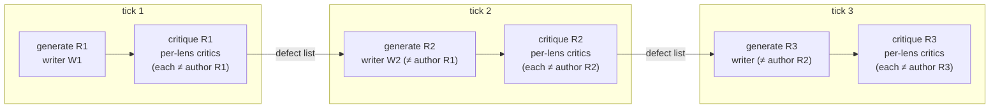
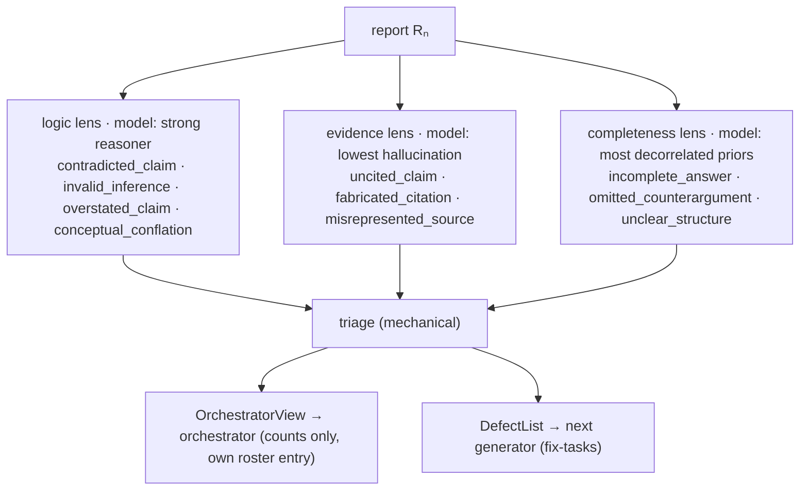
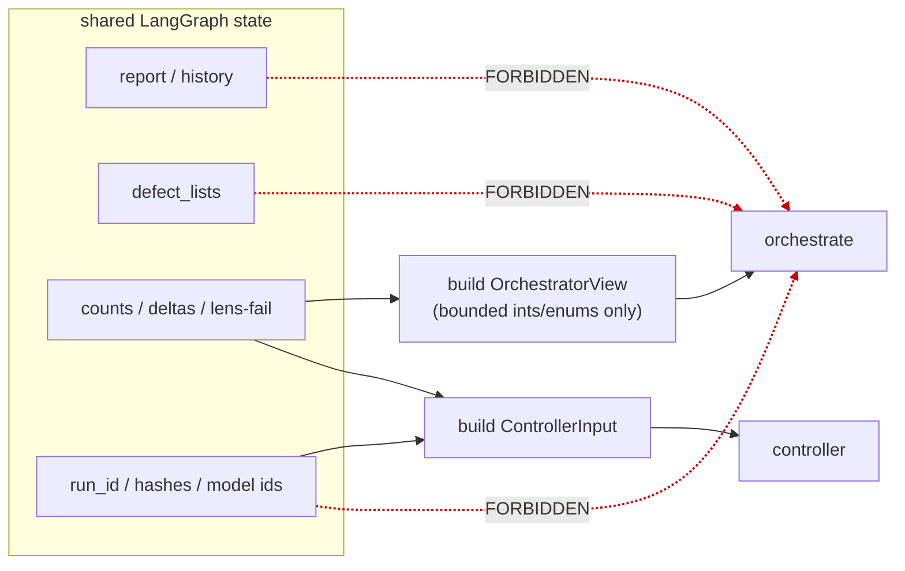
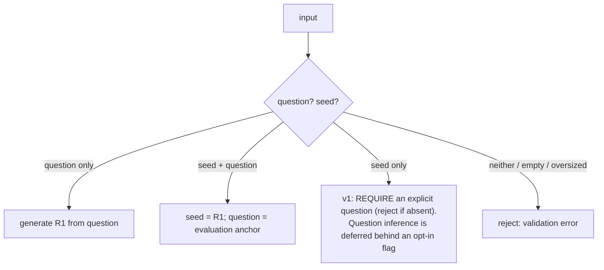
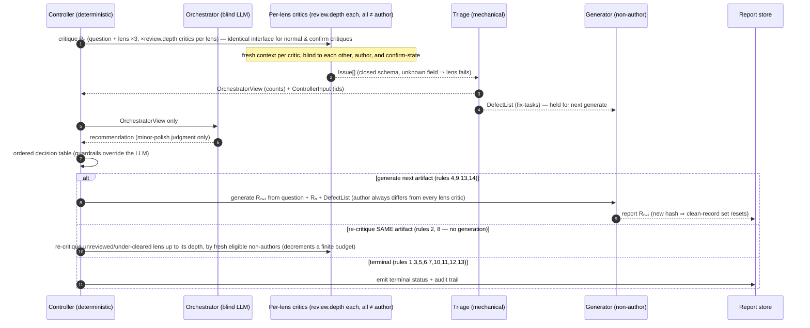

# Architecture — the LangGraph graph (v3)

## Roster structure & role assignment (D-per-lens-critics, D-critic-only-specialists)

The roster is **role-structured**, not a flat swap:

- **Writer pool** — models that author reports (round-robin as generators).
- **Per-lens critic pools** — each lens (logic / evidence / completeness) has its own set of
  eligible models, headed by the one best matched to that lens. Models may be **critic-only**
  (never author), which cleanly satisfies the author-exclusion rule and is how the roster's
  strongest model (`glm-5.2`) gets to review *every* draft instead of half of them.
- **Orchestrator** — the blind referee's model, configured separately (default `writers[0]`).

The one hard invariant: **a report is never critiqued — on any lens — by the model that authored
it.** With disjoint writer/critic pools this holds automatically; with overlap it is enforced per
tick. For a strong `accepted`, each lens pool must contain **≥2 eligible non-author model families**
so the dimension can be independently double-checked (see Acceptance in
[convergence.md](./convergence.md)); a lens with only one eligible family degrades that dimension
to `converged_unconfirmed`.

"Eligible" in this structural sense — non-author, distinct identity, distinct family — is what the
convergence controller counts. D-critic-audition adds an orthogonal **demonstrated-capability** term: `ra audition`
measures whether each critic can actually perform its lens (`fit` / `marginal` / `unfit`), `ra doctor`
reports the cached status, and `audition.enforce` fails startup closed on a cached `unfit` verdict
(`marginal` / stale / not-audited stay warnings). That gate runs in `build_runtime` before any tokens
are spent; it does not feed the stop decision.

The diagram below shows a minimal roster for clarity; generator selection is round-robin among
writers excluding the current artifact's author, preserving `critic(Rₙ) ≠ generator(Rₙ)`.


```mermaid
flowchart LR
    subgraph T1["tick 1"]
        G1["generate R1<br/>writer W1"] --> K1["critique R1<br/>per-lens critics<br/>(each ≠ author R1)"]
    end
    subgraph T2["tick 2"]
        G2["generate R2<br/>writer W2 (≠ author R1)"] --> K2["critique R2<br/>per-lens critics<br/>(each ≠ author R2)"]
    end
    subgraph T3["tick 3"]
        G3["generate R3<br/>writer (≠ author R2)"] --> K3["critique R3<br/>per-lens critics<br/>(each ≠ author R3)"]
    end
    K1 -->|defect list| G2
    K2 -->|defect list| G3
```

Each `critique` box is three lenses (logic / evidence / completeness), and each lens is read by
`review.depth` critic models — **two** by default (D-front-loaded-depth). Every one of them is a
fresh blind context, distinct at the resolved provider/model level, and excluded if it authored the
report under review. Writers rotate; a model may be a critic-only specialist (never a writer).

Invariants (enforced in code, covered by tests):
- `critic(Rₙ) ≠ generator(Rₙ)` — production ≠ review (holds for confirmation critiques too).
- `generator(Rₙ₊₁) ∈ writer_pool \ {author(Rₙ)}` — a writer, never the author, never a critic-only specialist.
- Models distinct at the **resolved** provider/model/version level, not just the alias (RA-017);
  prefer distinct providers/families per lens and **warn** when a lens's two critic models share a family (weak independence).

## Nodes and responsibilities

| Node | Reads | Produces | Model | Trust model |
|------|-------|----------|-------|-------------|
| **intake** | question + **markdown** seed | normalized `question` / `seed`; routing | none | deterministic |
| **generate** | question + latest report + **defect list** | next report (with citations) — under `revision.mode: patch` only the paragraphs a fix task named are edited, the rest returned byte-identical (D-scoped-revision) | non-author (alternating) | LLM (untrusted output) |
| **adjudicate** *(D-writer-disputes, opt-in)* | pending disputes + finding + one paragraph | `AdjudicationRecord[]` | mechanical fetch-check, else an arbiter ≠ disputer ≠ raiser | mechanical, or LLM inside a closed 2-field schema |
| **critique** | report + question + **one lens** + taxonomy | `Issue[]` per critic | `review.depth` non-author models per lens, drawn as one slate (`roles.critic_slate`) | LLM (untrusted output) |
| **triage** | this tick's `Issue[]` (minus **upheld-adjudication suppressions**, D-writer-disputes) | `OrchestratorView` + `DefectList` | none — **mechanical** | deterministic |
| **orchestrate** | `OrchestratorView` **only** | recommendation (minor-polish judgment) | LLM, blind | LLM inside guardrails |
| **controller** | `ControllerInput` | decision + terminal status | none | **deterministic — owns termination** |
| **finalize** | best report + history | final report + terminal status + audit trail | none | deterministic |

> **Trust model (RA-020, RB-004):** the orchestrator is a *blind LLM* whose authority is limited to
> the minor-polish judgment; the **deterministic controller** owns every hard transition and
> termination. See the ordered decision table in [convergence.md](./convergence.md).

## The 3 lenses (per-lens critic pools, a fresh context per critic)

Each lens is assigned its own critic pool (D-per-lens-critics) — pick the best tool per dimension. The only hard
rule is that a lens's model must **not** be the author of the artifact under review.


```mermaid
flowchart TD
    R["report Rₙ"] --> L1["logic lens · model: strong reasoner<br/>contradicted_claim · invalid_inference · overstated_claim · conceptual_conflation"]
    R --> L2["evidence lens · model: lowest hallucination<br/>uncited_claim · fabricated_citation · misrepresented_source"]
    R --> L3["completeness lens · model: most decorrelated priors<br/>incomplete_answer · omitted_counterargument · unclear_structure"]
    L1 --> TR["triage (mechanical)"]
    L2 --> TR
    L3 --> TR
    TR --> SR["OrchestratorView → orchestrator (counts only, own roster entry)"]
    TR --> DL["DefectList → next generator (fix-tasks)"]
```

Each lens runs on the head of its assigned pool, in a **fresh context**, blind to the others. They
emit `Issue[]` against a closed schema.

At `review.depth: 2` (the default, D-front-loaded-depth) each of those boxes is **two** critics
rather than one: the next distinct eligible non-author model in the pool reads the same artifact
under the same prompt, in its own fresh context, blind to the first critic and to what it found.
Depth is a ceiling — a lens the roster can staff only once runs one critic — and the union of the
slate's findings is triaged before any revision, with one finding counted once however many critics
report it (`triage.distinct_issues`).

## The DefectList — enough to actually fix a blocking issue (RB-005)

`{locus, category, severity, instruction}` alone cannot convey *which* two propositions
contradict, or *what* source/claim mismatch was seen — so a blocking defect could survive even
though the critic found it. The schema therefore carries **bounded, evidence-bearing fields**,
treated as untrusted data (length/format validated):

```
Defect {
  locus: StructuralRef            # section/paragraph index — NOT free text (RB-007)
  category: <closed enum>
  severity: <clamped to floor>    # RB-006
  claim_span: quoted, length-limited        # the offending claim (untrusted)
  related_span: quoted, length-limited      # e.g. the contradicting claim / cited passage
  citation_id: opt                # for citation categories
  expected_support: opt, bounded  # what the citation would need to show
  rationale: bounded (≤ N chars)  # concise, objective, no verdict language
  instruction: bounded            # concrete fix
}
```

Critic **provenance** (which lens/model raised it) is retained in the audit store but **not** in
the generator-facing form (authorship blindness, principle 3).

## Failure & invalid-output handling — fail closed (RA-007, RB-007)

No failure or invalid output can manufacture a clean review. The earlier contradiction ("repair →
failed lens" vs. "unknown categories dropped") is resolved **in favor of fail-closed**:

| Failure | Behavior |
|---------|----------|
| Unknown enum / invalid or over-length field in any issue | **fails the entire lens** — never silently dropped |
| Malformed / schema-violating critic output | up to *R* bounded repair retries; then lens **failed** |
| A **lens with no completed review** in a tick | `lenses_failed > 0` ⇒ review incomplete ⇒ controller rule 2 (re-critique); budget exhausted ⇒ rule 3 `fatal` → `aborted` |
| One critic of a lens fails while another **completes** (only possible at `review.depth ≥ 2`) | the failed review contributes nothing — no issue, no clean record; the lens is *reviewed*, so rules 2/3 do not fire. The missing depth lands on `cleared_count`, so the artifact cannot be accepted: rule 8 tops it up if clean, rule 14 replaces it if not (D-front-loaded-depth) |
| A **dispute** cannot be adjudicated (no eligible arbiter, arbiter down/malformed, budget spent) | recorded `dismissed` with the concrete method; **the finding stands** — every non-`upheld` path is the status quo ante (D-writer-disputes) |
| The **dispute-elicitation** call fails or returns garbage | `dispute_pass_failed` event; the revision proceeds with no disputes — never fatal (D-writer-disputes) |
| Per-call timeout | retry within budget; exhausted ⇒ `fatal` |
| Empty `Issue[]` | mints a clean record for **that critic** only if its own call completed; the lens counts as clean only if every lens has a completed review |
| Generator failure | retry within budget; exhausted ⇒ `fatal` |
| **Confirmation** critique failure | handled identically to any critique (RB-003) — triaged, budgeted, returned through the controller |

## Round identity & resumability (RA-014)

Every report and critique is keyed by `(run_id, round, artifact_hash, generator_model,
critic_model, lens, attempt, confirm_state)`. Reducers are idempotent; results whose
`artifact_hash` doesn't match the current round are rejected (guards against LangGraph
retries/replay faking convergence). A checkpointer persists state for resuming the slow local run.

## Surviving a redeploy

The service is continuously deployed: it receives SIGTERM, a grace window, and then
SIGKILL, none of which it controls. A run is 10–25 minutes, so finishing one inside the
grace window is not achievable and is not attempted.

The guarantee comes from the checkpointer, not the grace period. State is persisted at
every node boundary, so a hard kill costs at most the node in flight — never the run.
**The graceful path is therefore an optimisation, not a correctness mechanism:** it buys
the chance to land the in-flight node instead of re-paying for it after the restart.
Shortening the grace period wastes work; it does not corrupt anything.

* **On SIGTERM** the run stops at the next node boundary and records a `pause` event.
  `graph.run()` streams the graph rather than calling `invoke()`, because a completed,
  checkpointed node is the only instant at which stopping costs nothing.
* **On startup** every run the registry reports as `queued` or `interrupted` is
  re-enqueued (`RunWorker.recover`). Nobody should have to notice a deploy, let alone
  click resume.
* **The queue is not the record of what is owed.** Jobs are written to `events.jsonl`
  before being enqueued, so a process that dies holding a full queue loses nothing.
* **Runs that never progress are abandoned** after `max_resume_attempts` consecutive
  fruitless auto-resumes, so a deterministically-failing run cannot be retried forever.
  Abandonment writes an event, never a `final.json` — that file means the controller
  reached a verdict, and giving up is not a verdict. A human can always resume past it.
* **A roster change invalidates every in-flight run.** `_run_fingerprint` covers the
  roster and budgets, so a deploy that also ships a new `config/roster.yaml` will refuse
  to resume runs started under the old one. That refusal is correct — it lands them in
  `abandoned` rather than looping.

Deadlines nest, all derived from `RA_SHUTDOWN_GRACE_SECONDS`: the platform's
SIGTERM-to-SIGKILL budget contains uvicorn's connection drain, which contains the
worker's wait for a node boundary.

## Structural isolation of the orchestrator (RA-002, RB-004, RB-008)


```mermaid
flowchart LR
    subgraph STATE["shared LangGraph state"]
        RPT["report / history"]
        DEF["defect_lists"]
        CNT["counts / deltas / lens-fail"]
        IDS["run_id / hashes / model ids"]
    end
    CNT --> OV["build OrchestratorView<br/>(bounded ints/enums only)"]
    OV --> orchestrate
    CNT --> CI["build ControllerInput"]
    IDS --> CI
    CI --> controller
    RPT -. FORBIDDEN .-> orchestrate
    DEF -. FORBIDDEN .-> orchestrate
    IDS -. FORBIDDEN .-> orchestrate

    linkStyle 5,6,7 stroke:#c00,stroke-width:2px;
```

The orchestrate call's signature accepts **only** an `OrchestratorView` (no ids, hashes, or
content). The controller may see identifiers (it is deterministic and still blind to report
*content*). Noninterference is tested over `OrchestratorView`.

## Intake routing (RA-018)


```mermaid
flowchart TD
    IN["input"] --> Q{"question? seed?"}
    Q -->|question only| A["generate R1 from question"]
    Q -->|seed + question| C["seed = R1; question = evaluation anchor"]
    Q -->|seed only| B["v1: REQUIRE an explicit question (reject if absent).<br/>Question inference is deferred behind an opt-in flag"]
    Q -->|neither / empty / oversized| E["reject: validation error"]
```

`min_ticks` applies on the seed path too — a provided report is never accepted on its first
critique. Intake validates size and normalizes.

**Report shape is a fixed frame with a free middle (D-report-template).** Every writer call —
first draft, revision, polish — carries `prompts.REPORT_SKELETON` in its system prompt:
`## Conclusion` first (a direct, cited answer that also names the strongest opposing view),
`## Key findings`, `## The strongest counterargument` (steelmanned and engaged, never merely
listed), then writer-chosen topical sections, and `## Sources` last. The `## Sources` heading
is byte-exact because `fetch._SOURCES_HEADING` matches only a heading whose text is the word
"sources", and `triage._locate_url` assumes the section is last. The frame is prompt-only —
a violation is the `unclear_structure` lens's business, not a new mechanical gate — and a
seeded round-1 artifact keeps its own shape until the first revision steers it toward the
frame.

**Format conversion happens at the edge, not here.** `intake` requires markdown, because
`report.parse` builds the `[S<n>.P<m>]` loci from `#` headings and `fetch.extract_source_urls`
reads only a markdown `## Sources` section. The CLI and the web layer therefore run
`ingest` (PDF, `.docx`, HTML, `.txt`, or an http(s) URL → markdown) *before* calling
`graph.run`, so that the text hashed into the resume fingerprint is byte-for-byte the text
that is stored, critiqued and revised — one artifact, one identity. A seed whose format
carried no headings is accepted with a warning; the warning rides the run's existing
`warnings` channel, and the format and origin are recorded on the `intake` event.

## Operational requirements (RA-015, RA-016, RA-017)

- **Roster (role-structured):** a **writer pool** plus **per-lens critic pools**; each lens pool
  sized to **≥2 eligible non-author model families** for a strong `accepted` (a single-family lens
  degrades that dimension to `converged_unconfirmed`). Critic-only specialists are allowed and are how the
  strongest model reviews every draft. Resolve/record provider/model/version behind each LiteLLM
  alias — including the orchestrator's — and enforce distinctness at that level; no silent fallback
  to a duplicate. **Fail closed** (abort) if any lens has zero eligible non-author model or the
  writer pool is empty. Prefer distinct providers/families per lens; warn when a lens's two models
  share a family (weak decorrelation) — the family key is derived from the *model name*, not the
  provider or serving backend, so two checkpoints of one base model cannot look independent by
  being served differently. Startup resolves identities and probes structured-output support for
  every alias in the roster (writers, critics, and the orchestrator), validates per-lens roster
  health, and checks the config invariant `0 < min_ticks < hard_cap` (fail closed) so no generating
  rule can fire at or beyond the cap.
- **Writer-pool depth (D-provider-retry):** author exclusion applies to writers too, so the pool the *next* draft
  may come from is `writers \ {author(Rₙ)}`. Size the pool for **≥2 eligible writers on a revision
  round** — i.e. at least three writers — or one flaky response is an aborted run rather than a
  retry. This is a sizing recommendation, not a fail-closed check: a two-writer roster is legal and
  still runs, it just has no lateral move when its one eligible writer misbehaves.
- **Concurrency/limits:** bounded concurrency (a pass fans out over every critic slot — `review.depth`
  per lens — as one flat work list under `budgets.max_concurrency`, so raising the depth costs
  wall-clock and never instantaneous proxy load), per-call timeout + retry budget, token/context
  budgeting for the slow local model, backpressure so parallel lenses don't overload one
  proxy/model.
- **Review depth (D-front-loaded-depth):** `review.depth` (default 2, per-lens overridable) is how
  many eligible non-author critics read each lens on **every** draft. Depth is a ceiling clamped by
  the fresh eligible pool, so it can never turn a `roster_limited` lens into an abort; every slot is
  a separate fresh context and re-checks author exclusion at the call.
- **Transient-failure posture (D-provider-retry):** every retry waits — exponential with jitter, bounded by
  `budgets.retry_backoff_seconds` / `retry_backoff_max_seconds`, and a provider's own `Retry-After`
  wins where it sends one. Failures whose status says the *request* is wrong (400/401/403/404/413/
  422) raise `PermanentCallError` immediately instead of consuming the budget. A completion is never
  empty: an agentic loop that ends on a tool call gets exactly one further toolless round asking for
  prose, and raises if that is empty too, so no caller can mistake a stalled loop for a model that
  wrote nothing. A tool whose own budget is spent is withdrawn from subsequent rounds rather than
  offered for rounds it cannot serve.
- **Submission backpressure (RC-007):** concurrency bounds token *spend* but not how many runs may
  pile up, so submission is also bounded. `RunWorker.submit()` refuses with **HTTP 429** once the
  queue's waiting depth reaches `max_queue_depth`, and a fixed-window `submit_rate_max` /
  `submit_rate_window_seconds` limiter caps how fast one caller may open new runs — keyed by the
  caller's resolved identity (Cloudflare Access email first, then the Tailscale header, then the
  optional `auth.dev_identity`), the same identity the auth middleware enforces (D-identity-header). There is no
  shared global bucket: a request carrying no identity is refused by the middleware before it
  reaches submission at all. Both checks run **before** any run directory is written, so a refused
  submission costs no disk.
  `resume()` and boot-time `recover()` bypass both bounds: they replay work already owed and on disk.
- **Audit/privacy (concrete):** `runs/<id>/` holds sensitive seed material → least-privilege file
  perms (0700 dir), configurable retention (default: raw reports/critiques purged after N days;
  `OrchestratorView`/decisions retained longer), an explicit `purge <run_id>` command, and LiteLLM
  proxy request logging **disabled or content-scrubbed** for artifact text. The web server runs an
  automatic content-only sweep every `retention_sweep_interval_seconds` (RC-007), reclaiming the
  bulk of disk past `retention_days` without waiting for a manual `purge`; live runs are skipped and
  full-directory removal stays the explicit human escape hatch, keeping the decision record longer.

## Round sequence (one tick)


```mermaid
sequenceDiagram
    autonumber
    participant C as Controller (deterministic)
    participant O as Orchestrator (blind LLM)
    participant K as Per-lens critics (review.depth each, all ≠ author)
    participant T as Triage (mechanical)
    participant G as Generator (non-author)
    participant S as Report store

    C->>K: critique Rₙ (question + lens ×3, ×review.depth critics per lens) — identical interface for normal & confirm critiques
    Note over K: fresh context per critic, blind to each other, author, and confirm-state
    K-->>T: Issue[] (closed schema, unknown field ⇒ lens fails)
    T-->>C: OrchestratorView (counts) + ControllerInput (ids)
    T-->>G: DefectList (fix-tasks) — held for next generate
    C->>O: OrchestratorView only
    O-->>C: recommendation (minor-polish judgment only)
    C->>C: ordered decision table (guardrails override the LLM)
    alt generate next artifact (rules 4,9,13,14)
        C->>G: generate Rₙ₊₁ from question + Rₙ + DefectList (author always differs from every lens critic)
        G-->>S: report Rₙ₊₁ (new hash ⇒ clean-record set resets)
    else re-critique SAME artifact (rules 2, 8 — no generation)
        C->>K: re-critique unreviewed/under-cleared lens up to its depth, by fresh eligible non-authors (decrements a finite budget)
    else terminal (rules 1,3,5,6,7,10,11,12,13)
        C->>S: emit terminal status + audit trail
    end
```
