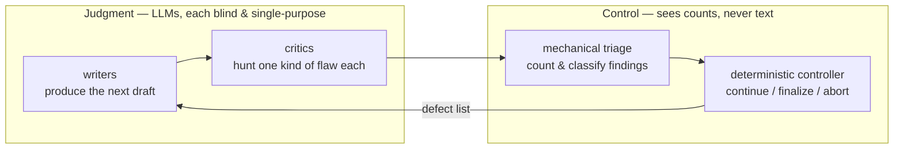
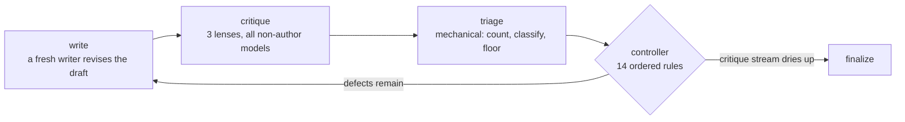

# The concept — why this works

This is the approachable tour. It explains *why* the system is shaped the way it is, with the
minimum of jargon. If you want the full design — schemas, invariants, proofs of termination —
follow the pointers at the [end](#where-to-go-deeper). If you want to run it, see the
[README](../README.md).

## The problem: LLMs are bad judges of their own work

Large language models are genuinely good at two things this system depends on:

- **Generating**: given a question and a list of concrete problems to fix, a model produces a
  competent next draft.
- **Spotting a specific flaw placed in front of them**: given one document and one narrow
  question — "does this citation actually exist?", "does this conclusion follow from these
  premises?" — a model is a sharp reviewer.

And they are reliably bad at the surrounding activity that turns those skills into a trustworthy
result:

- **Self-review.** A model asked to critique its own output mostly grades its own homework
  generously. It made the errors *because* it couldn't see them.
- **Sycophancy.** A model shown someone else's verdict drifts toward that verdict instead of
  forming its own.
- **Context pollution.** Judgment degrades as a conversation accumulates: prior reasoning,
  social dynamics, and earlier drafts all leak into what should be an independent look.
- **No stopping rule.** Ask models to review each other in a loop and they either agree too
  early (politeness) or never agree at all (the nitpick spiral — ever-smaller objections,
  forever). A model cannot tell you, calibratedly, "this is done."

Every design choice in this repo is one of those strengths pressed against one of those
weaknesses.

## The core move: separate judgment from control

The system splits the work into two kinds and gives each to the party that can actually do it:

- **Judgment** — "is this claim supported? is this inference valid?" — goes to LLMs, but only
  in the narrow form they're good at: many single-purpose reviewers, each in a **fresh context**,
  each seeing one document and one question, blind to who wrote it and to what anyone else said.
- **Control** — "keep going or stop? ship it or escalate?" — goes to a **deterministic
  controller** plus a referee that is *structurally incapable* of being charmed: it sees only
  category-by-severity counts (how many blocking issues, how many major), never a word of the
  report. Good prose cannot sway a referee that cannot read it.

Everything else in the design is a multiplication of that split along three axes: **lenses**,
**models**, and **ticks**.

## Multi-lens: one narrow job per reviewer

"Review everything" is a weak prompt — it invites vague, unfocused feedback. So no critic here is
asked to review everything. Each review pass runs three **lenses**, each a separate model call in
a fresh context with exactly one job:

- **logic** — do the conclusions follow? Catches contradictions, invalid inferences, overstated
  claims, and loaded framing.
- **evidence** — is the support real? Catches fabricated citations, misrepresented sources,
  uncited claims, and one-sided source selection.
- **completeness** — what's missing? Catches omitted counterarguments, unexamined presuppositions
  inherited from the question, and unclear structure.

Narrowing the question is what turns an LLM from a mediocre editor into a sharp one: "find
fabricated citations in this report" plays directly to the spot-the-flaw strength. It also makes
the output *checkable* — every finding must name an observable category from a closed list and
point at a verbatim quote from the report. There is no category for "I have a bad feeling about
this," and no way to raise an objection about the author's *intent*. If a critic can't anchor a
finding in the text, the finding doesn't exist.

The bias-shaped categories (loaded language, one-sided sourcing, unexamined presuppositions) are
governed by an explicit rulebook, [bias.md](./bias.md) (D24) — including what critics must *not*
do, like demanding false balance where the evidence genuinely points one way.

## Multi-model: different minds, decorrelated blind spots

Running the same model twice in two fresh contexts fixes context pollution, but not blind spots:
a model that misses a flaw once tends to miss it every time, systematically. So the roster mixes
**distinct models from distinct families** (different labs, different training corpora), because
different models fail differently. Where one family's blind spot sits, another family sees fine.

Three roster rules do the heavy lifting:

- **No model ever reviews its own draft.** A critic of round *n* is never the writer of round
  *n* — on any lens. Self-review is removed structurally, not discouraged by prompt.
- **Consecutive drafts have different authors.** The model fixing the defects is never the model
  that made them — and since it receives a task list rather than someone's opinion, there is no
  peer verdict to be sycophantic toward.
- **A verdict needs two distinct witnesses.** Full acceptance means every lens was cleared by at
  least **two different non-author models** looking at the *identical* final text. One model's
  approval is an opinion; two decorrelated models finding nothing is evidence.

One deliberate asymmetry: the strongest model in the roster never writes — it is a
**critic-only specialist**. If it wrote drafts, the no-self-review rule would bar it from
reviewing them, and the roster would lose its best reviewer exactly when it mattered.

## Multi-tick: iteration instead of a verdict

A single review pass — even a good one — produces a critique, not a better report. So the system
runs an alternating game, in rounds called **ticks**:

Each tick, a *different* writer receives the current draft plus a depersonalized defect list and
produces the next draft; fresh non-author critics then review it. Two ideas make the loop sound:

**Convergence is temporal, not a vote.** The three lenses look for different things, so they can
never corroborate each other — and they don't have to. Agreement is inferred from the critique
stream *drying up*: when writers keep fixing and critics keep finding nothing material, across
models and across rounds, the report has earned its acceptance. Nobody ever declares it good;
everyone eligible simply fails to demonstrate it's bad.

**Stopping is deterministic.** The models cannot end the game, politely or otherwise. A
controller — an ordered table of fourteen rules, plain code, provably terminating — owns the
stop decision. It enforces a floor (a draft is never accepted on its first critique), a hard cap
on rounds, and early exits for stagnation (the same defects three ticks running) and cycles (the
drafts started repeating). If the cap is hit with issues outstanding, the run ships its
*best-scoring* draft with an honest status like `needs_human_review` — it never quietly launders
an exhausted run into an accepted one. The one LLM near this decision, the orchestrator, is the
blind referee from the diagram above: its entire authority is a yes/no on cosmetic polish, decided
from counts alone.

## Keeping the game honest

The three axes above are the architecture. A set of smaller mechanisms keeps players from gaming
it — each one, again, a guard against a known LLM failure mode:

- **Depersonalized handoffs.** Critiques never travel as prose. Triage converts them into
  structured fix-tasks — category, severity, location, a verbatim quote, an instruction — with the
  critic's identity stripped. The next writer experiences "improve the artifact," never "someone
  judged you," and a critic has no free-text channel through which to steer (or prompt-inject)
  the writer.
- **Severity floors, clamp-up only.** Every category has a mechanical minimum severity — a
  fabricated citation is *always* blocking. A critic can escalate, never soften, so materiality
  cannot be negotiated away.
- **Fail closed.** A malformed critique fails its whole lens rather than being silently dropped,
  and "no issues" only counts if every lens actually completed. Silence is never evidence.
- **Clean records reset.** Every attestation of "this lens found nothing" is bound to the exact
  bytes of one draft. Touch the draft and all attestations evaporate — stale approvals can never
  carry a new text to acceptance.
- **Search and source verification.** Writers can be given a real web-search tool, so cited URLs
  are ones a search actually returned rather than remembered (LLM memory is where fabricated
  citations come from). Optionally the system fetches the cited pages and hands them to the
  evidence lens, turning "does this source say that?" from a plausibility guess into a check
  against the page.
- **Date grounding.** Every prompt carries the run's actual date, because a model's sense of
  "now" is frozen at its training cutoff — without this, critics have flagged legitimate current
  citations as impossible future-dated fabrications.
- **Auditioning the critics.** Trusting a critic because it's an LLM would repeat the original
  sin. So critics are auditioned offline against reports with *planted* defects and known-sound
  controls, and graded by plain code — measuring both whether they catch what's there and whether
  they invent what isn't. An LLM grader is expressly forbidden: the harness must not depend on
  the property it exists to measure.
- **The dispute channel.** Critics can be wrong, and a false positive is otherwise
  indistinguishable from a real defect — floors escalate it, the blind referee counts it, and a
  compliant writer would "fix" the report into falsehood. An opt-in channel (D25) lets the writer
  dispute a finding with evidence; mechanically verifiable disputes (the quote really is on the
  cited page) are upheld by plain code, and the rest go to a fresh-context arbiter that defaults
  to the finding under uncertainty. Nothing is ever suppressed without an explicit verdict.

The through-line, one last time: every boundary in this system exists to keep one model's output
— or ego — from polluting another model's independent judgment, and every decision that requires
calibration or restraint is taken away from the models entirely and given to code.

## Where to go deeper

| you want | read |
|---|---|
| the design overview, roster, and isolation principles | [DESIGN.md](./DESIGN.md) |
| the actual graph, node roles, and failure handling | [architecture.md](./architecture.md) |
| the stop rules, taxonomy, and terminal statuses | [convergence.md](./convergence.md) |
| exactly what each agent can and cannot see | [isolation.md](./isolation.md) |
| the bias rulebook | [bias.md](./bias.md) |
| why each decision was made (and what reviews found) | [decisions.md](./decisions.md) |
| running it | [../README.md](../README.md) |
