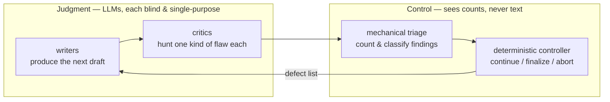
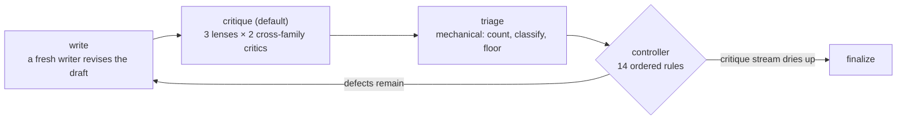

# The concept — why this works

This is the approachable tour. It explains *why* the system is shaped the way it is, with the
minimum of jargon. If you want the full design — schemas, invariants, proofs of termination —
follow the pointers at the [end](#where-to-go-deeper). If you want to run it, see the
[README on GitHub](https://github.com/NickBorgers/reasonable-answer#readme).

## The problem: LLMs are bad judges of their own work

Large language models are genuinely good at two things this system depends on:

- **Generating**: given a question and a list of concrete problems to fix, a model produces a
  competent next draft.
- **Spotting a specific flaw placed in front of them**: given one document and one narrow
  question — "does this citation actually exist?", "does this conclusion follow from these
  premises?" — a model is a sharp reviewer.

And they are reliably bad at the surrounding activity that turns those skills into a trustworthy
result:

- **Self-review.** A model asked to critique its own output mostly grades its own homework
  generously. It made the errors *because* it couldn't see them. Asked to self-correct reasoning
  without external input, models often come out *worse* than they went in
  ([Huang et al. 2024](https://arxiv.org/abs/2310.01798)); a survey of the whole literature found
  no prior work demonstrating successful self-correction from a prompted LLM's own feedback
  ([Kamoi et al. 2024](https://arxiv.org/abs/2406.01297)). Evaluators also recognise their own
  writing and mark it up accordingly
  ([Panickssery et al. 2024](https://arxiv.org/abs/2404.13076)).
- **Sycophancy.** A model shown someone else's verdict drifts toward that verdict instead of
  forming its own — a general behaviour of state-of-the-art assistants, not a quirk of one model
  ([Sharma et al. 2023](https://arxiv.org/abs/2310.13548)).
- **Context pollution.** Judgment degrades as a conversation accumulates: prior reasoning,
  social dynamics, and earlier drafts all leak into what should be an independent look. Even
  setting the social effects aside, material buried mid-context is measurably harder for a model
  to use than the same material at either end
  ([Liu et al. 2023](https://arxiv.org/abs/2307.03172)).
- **No stopping rule.** Ask models to review each other in a loop and they either agree too
  early (politeness) or never agree at all (the nitpick spiral — ever-smaller objections,
  forever). A model cannot tell you, calibratedly, "this is done." Iterated refine-against-a-judge
  loops are also where a model starts optimising the judge rather than the artifact
  ([Pan et al. 2024](https://arxiv.org/abs/2402.06627)). Worth calibrating against humans, too:
  when NeurIPS 2021 sent 10% of submissions to two independent committees, they disagreed on 23%
  of papers, and about half the accept list would have changed on a rerun
  ([Beygelzimer et al. 2023](https://arxiv.org/abs/2306.03262)). Reviewers failing to converge is
  the normal condition of review, not a symptom of using LLMs for it.

Every design choice in this repo is one of those strengths pressed against one of those
weaknesses.

## The core move: separate judgment from control

The system splits the work into two kinds and gives each to the party that can actually do it:

- **Judgment** — "is this claim supported? is this inference valid?" — goes to LLMs, but only
  in the narrow form they're good at: many single-purpose reviewers, each in a **fresh context**,
  each seeing one document and one question, blind to who wrote it and to what anyone else said.
- **Control** — "keep going or stop? ship it or escalate?" — goes to a **deterministic
  controller** plus a referee that is *structurally incapable* of being charmed: it sees only
  category-by-severity counts (how many blocking issues, how many major), never a word of the
  report. Good prose cannot sway a referee that cannot read it.

```mermaid
flowchart LR
    subgraph judgment ["Judgment — LLMs, each blind &amp; single-purpose"]
        W["writers<br/>produce the next draft"]
        C["critics<br/>hunt one kind of flaw each"]
    end
    subgraph control ["Control — sees counts, never text"]
        T["mechanical triage<br/>count &amp; classify findings"]
        R["deterministic controller<br/>continue / finalize / abort"]
    end
    W --> C
    C --> T
    T --> R
    R -->|"defect list"| W
```

Everything else in the design is a multiplication of that split along three axes: **lenses**,
**models**, and **ticks**.

## Multi-lens: one narrow job per reviewer

"Review everything" is a weak prompt — it invites vague, unfocused feedback. So no critic here is
asked to review everything. Each review pass runs three **lenses**, and each lens is a separate
model call in a fresh context with exactly one job:

- **logic** — do the conclusions follow? Catches contradictions, invalid inferences, overstated
  claims, and loaded framing.
- **evidence** — is the support real? Catches fabricated citations, misrepresented sources,
  uncited claims, and one-sided source selection.
- **completeness** — what's missing? Catches an unanswered explicit part of the question,
  omitted counterarguments (including an easier objection substituted for the strongest case),
  unexamined presuppositions inherited from the question, and unclear structure. It does not invent
  a hidden goal, a "question behind the question," or an optional angle and call that unanswered.

Narrowing the question is what turns an LLM from a mediocre editor into a sharp one: "find
fabricated citations in this report" plays directly to the spot-the-flaw strength. It also makes
the output *checkable* — every finding must name an observable category from a closed list and
point at a verbatim quote from the report. There is no category for "I have a bad feeling about
this," and no way to raise an objection about the author's *intent*. If a critic can't anchor a
finding in the text, the finding doesn't exist.

The bias-shaped categories (loaded language, one-sided sourcing, unexamined presuppositions) are
governed by an explicit rulebook, [bias.md](./bias.md) (D-social-bias) — including what critics must *not*
do, like demanding false balance where the evidence genuinely points one way.

## Multi-model: different minds, decorrelated blind spots

Running the same model twice in two fresh contexts fixes context pollution, but not blind spots:
a model that misses a flaw once tends to miss it every time, systematically. So the roster mixes
**distinct models from distinct families** (different labs, different training corpora), because
different models fail differently — where one family's idiosyncratic blind spot sits, another
family often sees fine.

Often, not always. The decorrelation this buys is real but **partial**: every capable model is
trained on overlapping data, and when two of them are both wrong they are frequently wrong the
*same way*. Diversity de-risks the failures that are peculiar to one model; it cannot vote away
a mistake the whole model population shares. That shared residue is why the strongest checks in
this system come from outside the roster entirely — retrieval constrains a citation to a URL a
search actually returned, and source verification, when enabled, tests that citation against the
text of the fetched page rather than against another model's opinion; and the
[bias rulebook](./bias.md) exists precisely because a bias correlated across every rostered
model cannot be caught by adding more of them.

Three roster rules do the heavy lifting:

- **No model ever reviews its own draft.** A critic of round *n* is never the writer of round
  *n* — on any lens. Self-review is removed structurally, not discouraged by prompt.
- **Consecutive drafts have different authors.** The model fixing the defects is never the model
  that made them — and since it receives a task list rather than someone's opinion, there is no
  peer verdict to be sycophantic toward.
- **A verdict needs two cross-family witnesses, and both are called at once by default.** Full
  acceptance means every lens was cleared by at least **two different non-author model families**
  looking at the *identical* final text. With the shipped `review.depth: 2` default, both read every
  draft; `review.depth` and `review.per_lens` can configure that discovery depth. The second is not
  normally held back for a confirmation pass at the end, because a reviewer who disagrees is most
  useful before the run has acted on the first one's silence. They never see each other. One
  family's approval is an opinion; another family finding nothing is meaningfully stronger evidence
  — though never proof, because no two capable models fail fully independently.

One deliberate asymmetry: the strongest model in the roster never writes — it is a
**critic-only specialist**. If it wrote drafts, the no-self-review rule would bar it from
reviewing them, and the roster would lose its best reviewer exactly when it mattered.

## Multi-tick: iteration instead of a verdict

A single review pass — even a good one — produces a critique, not a better report. So the system
runs an alternating game, in rounds called **ticks**:

```mermaid
flowchart LR
    G["write<br/>a fresh writer revises the draft"] --> K["critique (default)<br/>3 lenses × 2 cross-family critics"]
    K --> TR["triage<br/>mechanical: count, classify, floor"]
    TR --> D{"controller<br/>14 ordered rules"}
    D -->|"defects remain"| G
    D -->|"critique stream dries up"| F["finalize"]
```

Each tick, a *different* writer receives the current draft plus a depersonalized defect list and
produces the next draft; fresh non-author critics then review it. Two ideas make the loop sound:

**Convergence is temporal, not a vote.** The three lenses look for different things, so they can
never corroborate each other — and they don't have to. Agreement is inferred from the critique
stream *drying up*: when writers keep fixing and critics keep finding nothing material, across
models and across rounds, the report has earned its acceptance. Nobody ever declares it good;
everyone eligible simply fails to demonstrate it's bad.

**Stopping is deterministic.** The models cannot end the game, politely or otherwise. A
controller — an ordered table of fourteen rules, plain code, provably terminating — owns the
stop decision. It enforces a floor (a draft is never accepted on its first critique), a hard cap
on rounds, and early exits for stagnation (the same defects three ticks running) and cycles (the
drafts started repeating). If the cap is hit with issues outstanding, the run ships its
*best-scoring* draft with an honest status like `needs_human_review` — it never quietly launders
an exhausted run into an accepted one. The one LLM near this decision, the orchestrator, is the
blind referee from the diagram above: its entire authority is a yes/no on cosmetic polish, decided
from counts alone.

## Keeping the game honest

The three axes above are the architecture. A set of smaller mechanisms keeps players from gaming
it — each one, again, a guard against a known LLM failure mode:

- **Depersonalized handoffs.** Critiques never travel as prose. Triage converts them into
  structured fix-tasks — category, severity, location, a verbatim quote, an instruction — with the
  critic's identity stripped. The next writer experiences "improve the artifact," never "someone
  judged you," and a critic has no free-text channel through which to steer (or prompt-inject)
  the writer. The framing appears to matter mechanically and not just socially: holding the
  erroneous claim byte-identical and changing only whether it is labelled the model's own thought
  or an external message moves the correction rate by tens of percentage points
  ([Chen et al. 2026](https://arxiv.org/abs/2606.05976)).
- **Severity floors, clamp-up only.** Every category has a mechanical minimum severity — a
  fabricated citation is *always* blocking. A critic can escalate, never soften, so materiality
  cannot be negotiated away. This is the oldest result the design leans on: a meta-analysis of
  clinical versus mechanical prediction found mechanically combining assessments about 10% more
  accurate on average than case-by-case holistic judgment, and only rarely worse
  ([Grove et al. 2000](https://pubmed.ncbi.nlm.nih.gov/10752360/)).
- **Fail closed.** A malformed critique fails its whole review rather than being silently
  salvaged, and "no issues" only counts if every lens actually got a completed review. Silence is
  never evidence.
- **Clean records reset.** Every attestation of "this lens found nothing" is bound to the exact
  bytes of one draft. Touch the draft and all attestations evaporate — stale approvals can never
  carry a new text to acceptance.
- **Search and source verification.** Writers can be given a real web-search tool, so cited URLs
  are ones a search actually returned rather than remembered (LLM memory is where fabricated
  citations come from). With the full feature set enabled, the system also attempts the
  addressable, deduplicated citation URLs up to `search.max_sources` and hands successful bodies
  to the evidence lens. Entries without a fetchable URL and entries beyond that cap remain
  unchecked. For attempted pages this turns "does this source say that?" from a plausibility
  guess into a check against the page — the same per-claim-against-fetched-text move
  that [FActScore](https://arxiv.org/abs/2305.14251) (Min et al. 2023) uses to score long-form
  factuality. (The shipped config leaves that last switch off only because fetching model-chosen
  URLs needs a network egress boundary the deployment must provide — see
  [ssrf-egress-isolation.md](./ssrf-egress-isolation.md); with one in place, it belongs on.)
  Retrieval is a floor, not a guarantee: a preregistered study of commercial legal-research tools
  built on retrieval still measured hallucination rates of 17–33%
  ([Magesh et al. 2024](https://arxiv.org/abs/2405.20362)), which is why the output is labelled
  *not fact-checked* no matter how many switches are on.
- **Date grounding.** Every prompt carries the run's actual date, because a model's sense of
  "now" is frozen at its training cutoff — without this, critics have flagged legitimate current
  citations as impossible future-dated fabrications.
- **Auditioning the critics.** Trusting a critic because it's an LLM would repeat the original
  sin. So critics are auditioned offline against reports with *planted* defects and known-sound
  controls, and graded by plain code — measuring both whether they catch what's there and whether
  they invent what isn't. A control is graded by every lens, so it has to be sound under every
  lens (D-control-soundness): a "sound" control carrying one real uncited claim scores every
  competent evidence critic as an inventor of defects, which is what it did. That cuts both ways,
  and usefully: the noise metric is a joint measurement of the model and the corpus, so a spike in
  it is a hypothesis about either. Five more control defects — a miscount, a source decomposed
  backwards, two self-contradictions and an unsupported attribution — were found by the critics
  the controls were grading, on the run that was grading them, and fixed
  (D-control-defect-sweep). The fixtures are
  written in the exact shape the writer prompt mandates — conclusion first, a counterargument
  section engaged on the merits, inline `[1]` citations resolving to a numbered `## Sources`
  section — because the harness uses the production critic prompt, and a corpus in any other shape
  would audit critics on documents no production writer may emit (D-fixture-report-shape). Several
  planted fixtures ship alongside the sound base they were mutated from, and every planted fixture
  is held to the same length and source-count band as the controls regardless, so class cannot be
  read off length, structure or topic: a model that passes by being conservative on long, balanced
  reports and aggressive on short ones has detected nothing. The corpus also has to
  hold up its end per lens: every lens carries at least one *obvious*-tier fixture, because the two
  fail-closed gates count only those, and at least one defect pinned to a real paragraph, because a
  defect matchable anywhere measures only which category the critic named (D-obvious-per-lens). The
  two failures that defeat the harness completely — never firing, and never once letting a sound
  report through — are hardcoded as unfit rather than left to a threshold. A verdict also has to
  cover the whole corpus: a call that fails the schema is graded as neither a hit nor a miss, so a
  model that reliably breaks on one fixture would have that fixture quietly dropped from its own
  denominators — a fixture nothing ever graded is now `unfit`, not a better score
  (D-audition-failure-coverage). An LLM grader is
  expressly forbidden: the harness must not depend on
  the property it exists to measure. Model judges carry documented and reproducible biases —
  position, verbosity, and self-enhancement among them
  ([Zheng et al. 2023](https://arxiv.org/abs/2306.05685)) — so a grader built from one would
  import exactly the failure modes the audition is supposed to detect. What the grader counts as
  a finding is the production predicate itself — `taxonomy.counts_for_convergence`, shared with
  triage (D-audition-stylistic-parity) — so a finding a real run would discard, such as a
  `stylistic` note a critic escalated to `major`, scores as neither a detection nor as invented
  noise. A grader that restates the rule instead of sharing it drifts from it. Covering every
  *lens* is not covering every *category*: because the grader scores a relaxed same-lens match, a
  critic blind to one category still passes on the strength of the others, so every category that
  floors at `major` or `blocking` now carries its own planted fixture and a test says so
  (D-category-coverage). The minor-floor categories — `unclear_structure`, `loaded_language` and
  `stylistic` — carry **no planted fixture at all**: a detection has to clear the material floor to
  count, so a fixture for one of them would grade a critic that finds it and files it honestly at
  `minor` as blind, measuring escalation rather than detection. `_check_planted_floor_is_material`
  refuses such a fixture at load, mechanically, rather than leaving it to review
  (D-minor-floor-fixtures).
  What the audition measures is also a **floor**, and deliberately a strict one: critics are graded with no
  fetched-source scaffolding whatsoever, while a deployment with source verification switched on
  hands its evidence critic a `fetched_sources_block` for every citation it attempted to fetch —
  including a paywalled, blocked or offline one, which still renders as a named failure entry
  rather than silence (D-audition-source-mode). So `fit` says only that the model can do the job
  on the artifact text alone, with nothing about any citation to lean on, not that it reads a
  fetched page well, and not even that it handles the weaker on-its-face prompt production runs on
  a citation whose fetch failed. Certifying either needs deterministic offline source packets
  shipped with the fixtures, which is an open item.
  A floor is still only a floor *of the right thing*: the audition pins every model to the same
  structured-output mode a run would pin it to, by probing the proxy before it measures anything
  (D-audition-probe-parity). Unprobed it did not, and a `schema_failures` count is a count of one
  particular extraction path — so a model reliable under `json_schema` was being graded on
  prompt-mode failures it would never have in production. The mode is recorded on the verdict and
  re-measured when it moves; the cache-read paths that must never spend a call read across a
  difference they cannot afford to detect, and `ra doctor` reports it instead.
- **The dispute channel.** Critics can be wrong, and a false positive is otherwise
  indistinguishable from a real defect — floors escalate it, the blind referee counts it, and a
  compliant writer would "fix" the report into falsehood. An opt-in channel (D-writer-disputes) lets the writer
  dispute a finding with evidence; mechanically verifiable disputes (the quote really is on the
  cited page) are upheld by plain code, and the rest go to a fresh-context arbiter that defaults
  to the finding under uncertainty. Nothing is ever suppressed without an explicit verdict.

The through-line, one last time: every boundary in this system exists to keep one model's output
— or ego — from polluting another model's independent judgment, and every decision that requires
calibration or restraint is taken away from the models entirely and given to code.

## Where to go deeper

| you want | read |
|---|---|
| the design overview, roster, and isolation principles | [DESIGN.md](./DESIGN.md) |
| the actual graph, node roles, and failure handling | [architecture.md](./architecture.md) |
| the stop rules, taxonomy, and terminal statuses | [convergence.md](./convergence.md) |
| exactly what each agent can and cannot see | [isolation.md](./isolation.md) |
| the bias rulebook | [bias.md](./bias.md) |
| who can see which runs, and how to sign in | [authentication.md](./authentication.md) |
| why each decision was made (and what reviews found) | [decisions.md](./decisions.md) |
| running it | [README on GitHub](https://github.com/NickBorgers/reasonable-answer#readme) |
