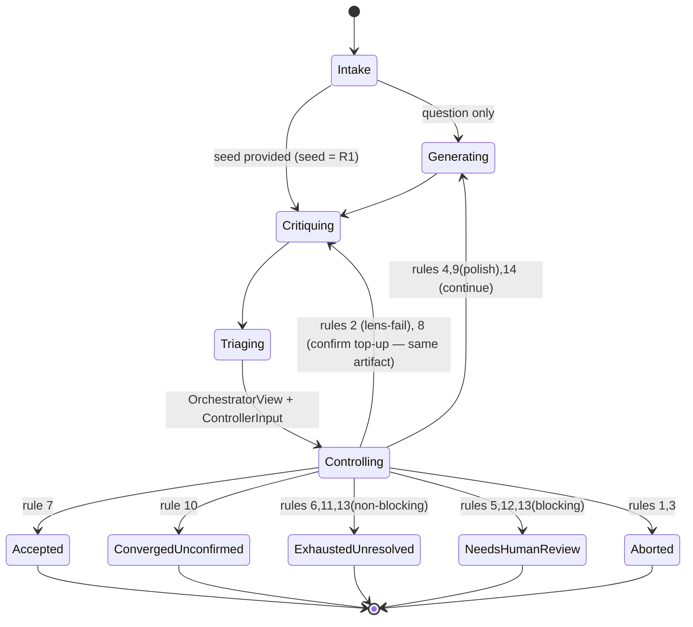

# Convergence — taxonomy, signals, and the stop decision (v3)

The controller decides when the report is sound enough to ship, when further ticks are just
nitpicking, or when substantive disagreement won't resolve. It reads only **signals**, never the
report, and it is bounded so it **always terminates**.

> **Isolation unit = the context window, not the model** (see [isolation.md](./isolation.md)).
> Fresh, blind contexts defeat the *primary* bias (social/context drift) regardless of model;
> a diverse roster is a *secondary* layer that decorrelates model blind spots and enables strong
> same-artifact acceptance. The roster is **role-structured** (D15/D16): a writer pool plus
> per-lens critic pools headed by the model best matched to each lens, sized to give **≥2
> eligible non-author models per lens** for strong acceptance.

## The observable-category taxonomy (RA-006) with mechanical severity floors (RB-006, RC-005)

Every issue carries an **observable category** and a **severity**. The critic proposes a severity,
but **triage clamps it up to a mechanical, category-specific floor** — the critic can only
*escalate*, never downgrade below the floor. There is **no critic-supplied materiality exception**
(removed per RC-005); floors are fully mechanical.

| lens | category | meaning | **mechanical floor** |
|------|----------|---------|----------------------|
| evidence | `fabricated_citation` | citation cannot be what it claims on its face | **blocking** |
| evidence | `misrepresented_source` | cited source does not support the claim as stated | **major** |
| evidence | `uncited_claim` | material claim with no citation | **major** |
| logic | `contradicted_claim` | claim contradicts another claim or a cited source | **blocking** |
| logic | `invalid_inference` | conclusion does not follow from premises | **major** |
| logic | `overstated_claim` | claim stronger than its support | **major** |
| completeness | `omitted_counterargument` | a material opposing view is missing | **major** |
| completeness | `unclear_structure` | organization/clarity impedes evaluation | minor |
| any | `stylistic` | cosmetic preference | minor (**ignored** for convergence) |

**Severity floor for convergence = `major`.** `material = blocking + major`. Convergence requires
`material == 0`; `minor`/`stylistic` never block. (Flooring `overstated_claim`/
`omitted_counterargument` at `major` is deliberately conservative and config-tunable.)

### Evidence handling (RA-011, D5, D17)

The report **carries its own citations**; the evidence lens challenges any material `uncited_claim`,
any on-its-face `misrepresented_source`, and any `fabricated_citation`. Citations must be
well-formed/resolvable in format.

**Retrieval is opt-in and off by default in code (D17); the shipped `config/roster.yaml` opts in
(D22).** The two postures differ in what a citation *is*:

* **`search.enabled: false` (default)** — no external retrieval, exactly as D5 specifies. A diverse
  roster can still share a factual blind spot, and a citation is whatever the writer recalled.
  Output is labeled *consensus-reviewed with in-artifact sourcing*, not fact-checked.
* **`search.enabled: true`** — writers hold a `web_search` tool and may cite only URLs a search
  actually returned, so a citation is a real, retrieved page. Output is labeled *consensus-reviewed
  with retrieved sourcing*, still not fact-checked. Startup fails closed if a writer cannot emit
  tool calls, because such a writer would still produce a `## Sources` section and fill it from
  memory — and no downstream check distinguishes that from a retrieved citation.

**Retrieval alone does not make the report fact-checked.** It constrains where citations come from;
it does not establish that a cited page *supports the specific claim attached to it*.

**Source verification (D18), also opt-in and off by default — including in the shipped roster,
which enables retrieval only (D22): verification fetches model-chosen URLs, and the egress
boundary that makes that safe is a deployment concern outside this repo
(docs/ssrf-egress-isolation.md).** With `search.verify_sources: true`
the pages the report cites are fetched and handed to the **evidence lens only**, as untrusted data.
Two categories change character:

| category | verification off | verification on |
|---|---|---|
| `fabricated_citation` | implausible on its face | the URL does not resolve |
| `misrepresented_source` | plainly would not support the claim | the fetched page does not contain the claim |

Only the evidence lens receives them. Logic and completeness cannot raise a citation category, so
page text would widen what those lenses see without widening what they may report.

**A failed fetch is never evidence of fabrication.** Sites block automated clients, paywall, and go
offline; the critic is told the difference explicitly, because treating "could not read" as "does
not exist" would manufacture `blocking` defects out of transient network conditions. Page text is
truncated and the critic is told so, so a claim it cannot see is not read as a claim the page
contradicts.

**Every prompt carries the run's date (D22).** A date-plausibility judgement ("this citation is
future-dated, so it must be fabricated") is only as good as the judge's sense of what day it is —
and without grounding, that sense is the critic model's training-data recency. Run
`run-75eb136b9bfb` stagnated to `needs_human_review` because the evidence lens repeatedly flagged
legitimate current-year citations, including one dated the previous day, as "future-dated"
blocking fabrications the writer could never resolve. The date is captured once at intake
(`run_date`, UTC) and injected into every writer and critic prompt, so a confirmation critique
stays byte-identical even across midnight (RB-010). It is deliberately absent from the audition
prompt-hash surface: it is run context, not lens semantics.

Even with both options on, the output is *consensus-reviewed with verified sourcing* — **not
fact-checked**. Verification establishes that a cited page exists and says something compatible
with the claim; it does not establish that the page is *right*, nor that the roster picked good
sources in the first place.

## Two signal schemas — content-free vs. operational (RB-004, RB-008)

**`OrchestratorView`** — the *only* thing the blind LLM orchestrator sees. Bounded ints/enums,
**no** identifiers, hashes, free text, or loci:

```
OrchestratorView {
  counts: { <category>: {blocking, major, minor} }
  totals: { blocking, major, minor }
  delta_material_vs_prev: int
  lenses_failed: int
  round: int, min_ticks: int, hard_cap: int
  roster_size: int
  lens_cleared: { <lens>: int }   # # distinct non-author models clean for this lens on current hash
  acceptance: enum{none, weak_met, strong_met}   # derived from lens_cleared + roster eligibility
  polish_used: int, polish_cap: int
  stagnation_count: int, cycle_detected: bool
}
```

**`ControllerInput`** — the deterministic controller (not an LLM; still blind to report content)
sees `OrchestratorView` **plus** every operational predicate the decision table consumes (RD-002):

```
ControllerInput = OrchestratorView + {
  fatal: bool
  run_id, artifact_hash, artifact_hash_history
  author_identity, roster_identities            # resolved provider/model/version
  clean_records: [CleanRecord]                   # for the CURRENT artifact_hash only
  critique_attempts_remaining: int               # lens-failure retry budget
  confirmation_attempts_remaining: int           # bounds the per-lens top-up loop (rule 8)
  polish_recommended: bool                        # from the orchestrator LLM
  polish_used: int, polish_cap: int
  stagnation_limit K: int, cycle_period L: int
}
```

Identifiers live here, never in the LLM's view. **Noninterference** (RB-008) is defined over
`OrchestratorView`.

## Acceptance evidence — immutable, hash-keyed records (RC-001, RC-002)

Records are **per-lens** (D15): each lens can be assigned its own critic model (the evidence lens
takes the lowest-hallucination model, since a fabricated citation is an attribution failure). A **per-lens
clean record** is created only when *that lens* completes (not failed) and finds no material issue
for its categories. Each record is immutable and keyed by:

```
CleanRecord { artifact_hash, lens, critic_resolved_identity, artifact_author_identity }
```

**Any new generation or polish output is a new `artifact_hash`, which resets the current
artifact's clean-record set** — stale attestations never satisfy acceptance (closes RC-002).

A lens is **strongly-cleared** for the current hash when **≥2 distinct non-author models** hold a
clean record for it; **weakly-cleared** when exactly one does (because the roster has only one
model eligible for that lens, or only one has reviewed so far). Then:

- **`strong_met`** (default): `material == 0` **and every lens is strongly-cleared** → terminal
  **`accepted`**. Every dimension has been independently double-checked by different, blind-spot-
  decorrelated models; no model ever reviews its own draft.
- **`weak_met`**: `material == 0` **and every lens is at least weakly-cleared**, with at least one
  lens only weakly-cleared **because the roster cannot supply a second eligible non-author model**
  for it (`roster_limited`) → terminal **`converged_unconfirmed`**. An honest, weaker guarantee that
  names exactly which dimension lacked a second reviewer. (All evidence is current-hash-only; there
  is no cross-artifact "consecutive-clean" mechanism.)

Why a lens with one capable model can't be strongly-cleared: the only other reviewer of the
author's content would have to be the author (or the same specialist), sharing its blind spots —
so a second *distinct* eligible model per lens is required (RC-001, generalized per-lens).

The confirming critique runs through the **identical critique interface/prompt**; `confirm_state`
is a controller-side label applied **after** output, invisible to the model, fresh context, no
cache reuse (RB-010).

## The stop decision — one exhaustive ordered table (RB-009, RC-003, RC-004)

The controller evaluates these **in order; first match wins**. This is the *whole* controller
function — lens-failure, polish, and cycle handling are all in the table (RC-003), and the
incomplete-review check precedes every clean/material/cap conclusion (RC-004). Inputs are exactly
the `ControllerInput` fields above.

The **non-generating** clean-artifact rules (7, 8, 10, 11) are **not gated on `round`**, so
confirmation top-up (rule 8) remains reachable *at the cap* — it neither generates nor advances
`round` (fixes RG-001). The one clean-artifact rule that **generates** (rule 9, polish) *is*
cap-gated (`round < hard_cap`) so the hard cap stays hard (RH-001). The `material > 0` cap terminals
(rules 5–6) are cap-gated too.

**Config invariant (validated at startup, fail closed):** `0 < min_ticks < hard_cap`. This
guarantees rule 4 (the only other generating rule) can never fire at or beyond the cap, so **no
rule generates once `round ≥ hard_cap`** and the hard cap is genuinely hard (RI-001).

| # | Condition | Action / terminal |
|---|-----------|-------------------|
| 1 | `fatal` (writer pool empty, a lens has no eligible non-author, repeated malformed) | **aborted** |
| 2 | `lenses_failed > 0` **and** `critique_attempts_remaining > 0` | **re-critique** failed lens(es) (→ Critiquing); `critique_attempts_remaining -= 1`; partial counts never used |
| 3 | `lenses_failed > 0` **and** no budget | **aborted** (cannot complete a review) |
| 4 | `round < min_ticks` | **continue** (generate) — never accept before `min_ticks` |
| 5 | `round ≥ hard_cap` **and** `blocking > 0` | **needs_human_review** |
| 6 | `round ≥ hard_cap` **and** `major > 0` | **exhausted_unresolved** |
| 7 | `material == 0` **and** `strong_met` | **accepted** |
| 8 | `material == 0` **and** `top_up_possible` (some lens `toppable` **and** `confirmation_attempts_remaining > 0`) | **re-critique** a toppable lens by a fresh eligible non-author model (→ Critiquing, **no** generation); `confirmation_attempts_remaining -= 1` |
| 9 | `material == 0` **and** `round < hard_cap` **and** `minor > 0` **and** `polish_recommended` **and** `polish_used < polish_cap` | **continue** (polish → generate; `polish_used += 1`) |
| 10 | `material == 0` **and** `weak_met` (every under-cleared lens is `roster_limited`) | **converged_unconfirmed** |
| 11 | `material == 0` (not strong, not toppable, not weak — confirmation budget spent) | **exhausted_unresolved** (clean-but-unconfirmed) |
| 12 | `cycle_detected` | **needs_human_review** (freeze best-scoring version) |
| 13 | `material > 0` **and** `stagnation_count ≥ K` | early terminal: **needs_human_review** if `blocking>0` else **exhausted_unresolved** |
| 14 | `material > 0` | **continue** (generate from defect list) |

Per-lens predicates: a lens is **`toppable`** when `cleared_count < 2` and a not-yet-used eligible
non-author model remains; **`roster_limited`** when `eligible_count < 2` (can never be strongly-
cleared). `strong_met` = `material==0` ∧ every lens `cleared_count ≥ 2`. `weak_met` = `material==0`
∧ every lens `cleared_count ≥ 1` ∧ every lens with `cleared_count < 2` is `roster_limited`.

**Totality & termination:** first-match semantics selects exactly one rule for every input state,
and rules 1–14 leave no state unhandled (every `material == 0` state matches one of 7–11; every
`material > 0` state matches 5/6 at the cap, or 12/13/14 otherwise). Each continue action strictly
decrements a finite measure: generation advances `round` toward `hard_cap` (rules 4, 9, 14) and —
given the `min_ticks < hard_cap` config invariant — no rule generates once `round ≥ hard_cap`; the
lens-failure retry budget bounds rule 2; `polish_cap`
(and the `round < hard_cap` gate) bounds rule 9; **`confirmation_attempts_remaining`
bounds rule 8** — critically, rule 8 re-critiques *without* generating, so it cannot loop forever
and falls through to rule 10/11's terminal when the budget is spent. Cycle/stagnation (rules 12–13)
force early exit. So the machine always halts.

**LLM authority is scoped to rule 9 only** — the minor-polish judgment. Every other rule is
deterministic and overrides the orchestrator; the LLM can never skip `min_ticks`, pass the cap, or
accept with material issues.

### Exact predicates

- **material issue:** severity ≥ floor (`major`).
- **signal-stagnation:** the per-category `{blocking, major}` multiset is unchanged for `K`
  consecutive ticks (a *stuck signal*, not proven semantic repetition).
- **cycle:** the `artifact_hash` sequence repeats with period ≤ `L` (byte-level).
- **best-scoring version:** minimal `w_b·blocking + w_m·major + w_n·minor`; ties → earliest round.

### Terminal statuses (RA-012, RC-001)

| status | meaning |
|--------|---------|
| `accepted` | **every lens strongly-cleared** on the identical final artifact — each dimension cleared by ≥2 distinct non-author models |
| `converged_unconfirmed` | every lens at least weakly-cleared, but ≥1 lens is `roster_limited` (only one eligible non-author model) — the record names the under-reviewed dimension |
| `exhausted_unresolved` | cap/stagnation reached with only non-blocking issues, or clean-but-unconfirmed at cap; returned **with annotations** |
| `needs_human_review` | cap/stagnation/cycle reached with **blocking** issues present |
| `aborted` | fatal (model unavailable, repeated malformed/incomplete review, empty writer pool, or a lens with zero eligible non-author critics) |

A known-unacceptable artifact is **never** labeled `accepted` or `converged_unconfirmed`.

These five are the statuses the **controller** issues, and they are the only ones ever
written to `final.json`. The registry reports two further *lifecycle* states that the
controller never issues and that carry no verdict about the artifact:

| state | meaning |
|-------|---------|
| `interrupted` | the process went away mid-run; the checkpoint makes it resumable |
| `abandoned` | recovery gave up — the resume attempt cap was reached, or the run's inputs no longer match its checkpoint |

`abandoned` is terminal for the UI, but it is deliberately **not** a `final.json`: giving
up is not a verdict, and the audit trail must never claim the controller reached one. A
human can always resume past it.

## Lifecycle state machine



The confirming critique re-enters at `Critiquing` and returns through `Controlling` like any other
critique — no side path to a terminal state (RB-003).
