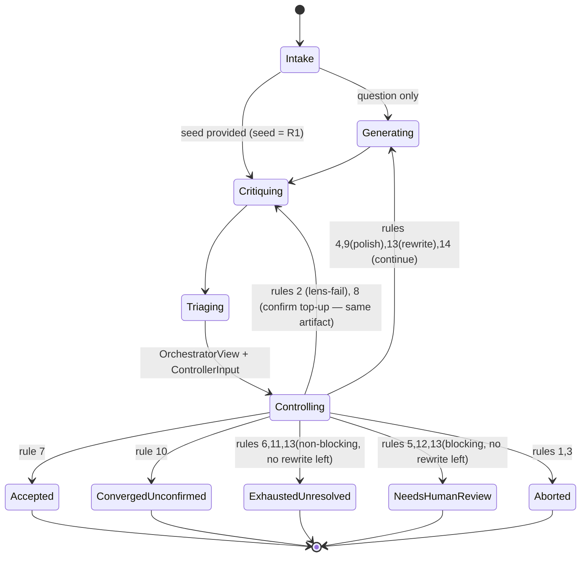

# Convergence — taxonomy, signals, and the stop decision (v3)

The controller decides when the report is sound enough to ship, when further ticks are just
nitpicking, or when substantive disagreement won't resolve. It reads only **signals**, never the
report, and it is bounded so it **always terminates**.

> **Isolation unit = the context window, not the model** (see [isolation.md](./isolation.md)).
> Fresh, blind contexts defeat the *primary* bias (social/context drift) regardless of model;
> a diverse roster is a *secondary* layer that decorrelates model blind spots and enables strong
> same-artifact acceptance. The roster is **role-structured** (D-per-lens-critics/D-critic-only-specialists): a writer pool plus
> per-lens critic pools headed by the model best matched to each lens, sized to give **≥2
> eligible non-author model families per lens** for strong acceptance.
>
> Those two models both read **every** draft (D-front-loaded-depth, `review.depth: 2`): review depth
> is what a pass spends, not what the end of a run collects. See
> [Review depth](#review-depth-both-reviewers-read-every-draft-d-front-loaded-depth) below for
> what that does and does not change about the table.
>
> *Eligible* throughout this document means **structurally** eligible — non-author, distinct
> identity, distinct family — which is all the controller reads. D-critic-audition adds a separate
> **demonstrated-capability** term (`ra audition` grades each critic `fit` / `marginal` / `unfit`);
> under `audition.enforce` a cached `unfit` verdict fails startup closed *before* the graph runs, so
> it never reaches the stop decision below. It gates whether the roster may run, not what any lens
> predicate here means.

## The observable-category taxonomy (RA-006) with mechanical severity floors (RB-006, RC-005)

Every issue carries an **observable category** and a **severity**. The critic proposes a severity,
but **triage clamps it up to a mechanical, category-specific floor** — the critic can only
*escalate*, never downgrade below the floor. There is **no critic-supplied materiality exception**
(removed per RC-005); floors are fully mechanical.

| lens | category | meaning | **mechanical floor** |
|------|----------|---------|----------------------|
| evidence | `fabricated_citation` | citation cannot be what it claims on its face | **blocking** |
| evidence | `misrepresented_source` | cited source does not support the claim as stated | **major** |
| evidence | `uncited_claim` | material claim with no citation | **major** |
| logic | `contradicted_claim` | claim contradicts another claim or a cited source | **blocking** |
| logic | `invalid_inference` | conclusion does not follow from premises | **major** |
| logic | `overstated_claim` | claim stronger than its support | **major** |
| logic | `conceptual_conflation` | two materially distinct things are treated as interchangeable, and the substitution carries an inference | **major** |
| completeness | `incomplete_answer` | an explicit, material part of the question is unanswered or replaced by an adjacent question | **major** |
| completeness | `omitted_counterargument` | a material opposing view is missing, or a purported opposing case substitutes an easier objection that does not challenge a load-bearing conclusion | **major** |
| completeness | `unclear_structure` | organization/clarity impedes evaluation | minor |
| any | `stylistic` | cosmetic preference | minor (**ignored** for convergence) |

**Severity floor for convergence = `major`.** `material = blocking + major`. Convergence requires
`material == 0`; `minor`/`stylistic` never block. (Flooring `overstated_claim`/
`incomplete_answer`/`omitted_counterargument` at `major` is deliberately conservative and
config-tunable.)

### Conceptual conflation, and anchors for empirical scope claims (D-conceptual-conflation)

> **Normative.** This subsection governs `Category.CONCEPTUAL_CONFLATION`, the empirical-anchor
> reading of `overstated_claim`, `LENS_BRIEF[Lens.LOGIC]`, and the three matching writer standards
> in `prompts.py::WRITER_SYSTEM`. Changing one side without the other is docs-as-spec drift.

**`conceptual_conflation` — the trigger.** Both halves are required:

1. two **materially distinct** concepts, mechanisms, units or populations are treated as
   interchangeable; **and**
2. the substitution is what carries a **load-bearing** inference or conclusion — keep the two
   apart and the conclusion no longer follows as stated.

The taxonomy names three distinctions that can satisfy this trigger. A **formal rule** (what a
statute, policy or specification provides), the **mediated mechanism** that implements it (who
administers it, at what
rate, subject to what other rule), and the **observed outcome** downstream are three propositions,
each needing its own support. The **units actually measured** and the **wider population** a claim
is made about are two different sets. And **groups that reach the same outcome by different
mechanisms** are not one group; a claim that generalizes across them, or a remedy that assumes one
lever reaches all of them, is where that shows.

**What it is not.** These exclusions are load-bearing — without them the category becomes a licence
to demand arbitrary distinctions, which is exactly the noise direction the audition measures:

- **Not terminology preference.** A different word for the same thing is not a conflation, whatever
  the critic would have called it.
- **Not a subgroup quota.** The absence of a breakdown is not the defect; a substitution is. There
  is no per-population disaggregation the report owes for its own sake.
- **Not a distinction that makes no difference here.** Where one mechanism, or one body of evidence,
  genuinely covers both things, treating them together is correct.
- **Not a defended aggregation.** A report that draws the distinction and then aggregates,
  explicitly, has done the work; disagreeing with the aggregation is `invalid_inference` territory
  if it is anything.

**Floor `major`, and not `blocking`.** It is `invalid_inference`'s sibling: the substitution is the
step the argument turns on, so a material floor is what forces the revision. Not blocking, because
unlike a contradiction nothing in the report is thereby shown false — and the fix is always
available inside the report (draw the distinction, or restrict the claim to the concept the support
covers). `related_span`, when supplied, must be a verbatim quote like the other logic categories'
(`triage.IN_ARTIFACT_RELATED`): both poles of a substitution are passages the report contains. It
stays optional, so a single sentence that fuses the two with no second passage is still reportable.

**Empirical scope claims are `overstated_claim`, explicitly.** Where a claim turns on **magnitude,
prevalence, timing or change**, and its only support is a thematic assertion rather than a concrete
figure or a source that states it, the claim is stronger than its support — which is the definition
of `overstated_claim`, widened here in the open rather than by drift. It is deliberately *not* a
new evidence category: the defect survives a perfect citation (a real source that describes the
phenomenon and measures nothing about it), so it is not a sourcing failure, and an evidence category
demanding a number would be unsatisfiable under `search.enabled: false`. It is deliberately not
writer-side-only either, because a writer standard nothing can raise is not detectable.

Two narrowings keep it from becoming "quantify everything":

- A claim about **kind, mechanism or character** turns on none of the four and owes no anchor;
  neither does one already qualified to the cases its support covers.
- The instruction may **never** demand a specific dataset or document as the only acceptable fix.
  Qualifying the claim to what the support establishes is always a complete resolution — the same
  resolvability contract every critic instruction carries.

### Evidence handling (RA-011, D-in-artifact-citations, D-retrieval-opt-in)

The report **carries its own citations**; the evidence lens challenges any material `uncited_claim`,
any on-its-face `misrepresented_source`, and any `fabricated_citation`. Citations must be
well-formed/resolvable in format.

**Retrieval is opt-in and off by default in code (D-retrieval-opt-in); the shipped `config/roster.yaml` opts in
(D-run-date-grounding).** The two postures differ in what a citation *is*:

* **`search.enabled: false` (default)** — no external retrieval, exactly as D-in-artifact-citations specifies. A diverse
  roster can still share a factual blind spot — error correlation survives differences in training
  data, architecture, and provider ([Kim et al. 2025](https://arxiv.org/abs/2506.07962)) — and a
  citation is whatever the writer recalled. Output is labeled *consensus-reviewed with in-artifact
  sourcing (no external retrieval)*, not fact-checked.
* **`search.enabled: true`** — writers hold a `web_search` tool and may cite only URLs a search
  actually returned, so a citation is a real, retrieved page. Output is labeled *consensus-reviewed
  with retrieved sourcing*, still not fact-checked. Startup fails closed if a writer cannot emit
  tool calls, because such a writer would still produce a `## Sources` section and fill it from
  memory — and no downstream check distinguishes that from a retrieved citation.

* **`search.read_sources: true`** (D-writer-source-reads, requires `enabled`) — the writer also
  holds `read_source` and may open a page **its own** searches returned, so a citation can be
  attached to text the writer read rather than to a snippet. This does **not** move the label: a
  read page shows what a page says, not that the page is right, so the output stays
  *consensus-reviewed with retrieved sourcing*. What it changes is what the writer is entitled to
  assert and what the run can afterwards show — see the traceability paragraph below.

**Retrieval alone does not make the report fact-checked.** It constrains where citations come from;
it does not establish that a cited page *supports the specific claim attached to it* — the
attributable-to-identified-sources distinction ([Rashkin et al. 2021](https://arxiv.org/abs/2112.12870)),
and the gap the labeling here is careful not to paper over. The empirical case for that caution:
a preregistered study of commercial legal-research tools built on retrieval still measured
hallucination rates of 17–33%, against vendor claims of being hallucination-free
([Magesh et al. 2024](https://arxiv.org/abs/2405.20362)).

**Source verification (D-source-verification), also opt-in and off by default — including in the shipped roster,
which enables retrieval only (D-run-date-grounding): verification fetches model-chosen URLs, and the egress
boundary that makes that safe is a deployment concern outside this repo
(docs/ssrf-egress-isolation.md).** With `search.verify_sources: true`, addressable cited pages are
deduplicated and attempted up to the anti-pathological `search.max_source_urls` ceiling
(D-unbounded-evidence), then handed to the **evidence lens only** as untrusted data; unaddressable
entries and addressable entries beyond that ceiling remain unchecked and are recorded as not attempted.
Two categories change character:

| category | verification off | verification on |
|---|---|---|
| `fabricated_citation` | implausible on its face | the URL does not resolve |
| `misrepresented_source` | plainly would not support the claim | the fetched page does not contain the claim |

Only the evidence lens receives them. Logic and completeness cannot raise a citation category, so
page text would widen what those lenses see without widening what they may report.

**A definitive not-found is resolution; every other failed fetch is not (D-notfound-fabrication).** An HTTP 404 or 410
(Gone) establishes that the cited URL does not exist — which is exactly what the table above calls
`fabricated_citation` under verification. That case is settled **mechanically**, in the fetch path
(`triage.mechanical_citation_issues`, raised from `graph._critique_one`), so the finding is a fact
the pipeline reports rather than a judgement a critic model must elect to make; it clamps to its
`blocking` floor like any other `fabricated_citation`.

**Every other failed fetch is never evidence of fabrication.** Sites block automated clients (403),
paywall, time out, go offline, or serve a body this cannot read — and treating that "could not
read" as "does not exist" would manufacture `blocking` defects out of transient network conditions.
The critic is told never to raise a defect on the basis of a failed fetch; only the definitive
not-found above is escalated, and that escalation is the pipeline's, not the model's. Each class is
now surfaced under its own `SourceOutcome` label (`BLOCKED`, `COULD NOT READ`, …) rather than one
flat "could not fetch", and an opt-in tier (`sources.enabled` **and** `sources.pdf.enabled`, both off
by default, fatal at startup without `pypdf`) **reads** a cited PDF rather than reporting it as an
unreadable content type — so "a body this cannot read" narrows to formats no converter handles. Page
text is truncated and the critic is told so, so a claim it cannot see is not read as a claim the page
contradicts.

**Existence is checkable even when the body is not (D-existence-vs-body, off by default).** With `sources.enabled`
and `sources.identifiers.enabled` both true, a cited URL that carries a DOI or PMID and would not
hand over its body is asked about at a bibliographic registry (Crossref, OpenAlex by default; arXiv
ids and PMCIDs are covered when arXiv and Europe PMC are added to the tier's provider list). A
confirmed record yields `metadata_only` — or `paywalled`, when the direct fetch was also refused —
and the critic is shown the citation details and, where one exists, the abstract, announced as
confirmation that the source **exists** and explicitly labelled as not being its text. This does
not sharpen
`misrepresented_source`: an abstract is a summary the authors wrote, so a claim's absence from one
is not evidence the paper does not make it, and the critic is told never to raise that category
against a source shown only as metadata. It does move a real paywalled paper out of the class that
looks like a fabricated one. In the other direction, an identifier that *every* authoritative
registry denies is a not-found and reaches the mechanical finding above — gated hard, because that
finding is blocking. With `sources.open_access.enabled` also true a free copy may be read; such a body
is marked as coming from a mirror rather than the cited URL, and can never settle a dispute about
that URL, because a preprint is not the version of record.

**Claim-level traceability is recorded, and is not a stop input (D-writer-source-reads).** With
`search.support_manifest` on (which requires `search.read_sources`), a draft **whose writer read at
least one page body** is followed by a separate structured pass in which that writer records
`citation_id -> url -> locator -> support_span -> claim` for every claim resting on a page it read.
A draft whose reads all failed — blocked, paywalled, not found, unreadable, or out of budget —
produces no manifest at all rather than an empty one: with no body in hand the pass would collect
spans nothing could check, which is the arrangement the `support_manifest` config guard refuses at
load time. So "no manifest for this round" means *nothing was readable*, never *nothing was
supported*. `support.check` rules on each
entry mechanically — the claim must be in the report, and the span must be in the cited page's
**own** body. Both must still contain text after quote normalization; markup-only or whitespace-only
values cannot establish support merely because the empty string is a substring of every document.
The check distinguishes "checked and false" (`span_not_found`) from the three ways an entry is
simply not checkable: no body was read (`body_not_read`, which covers an abstract and a paywall),
the body came from an open-access copy (`different_document`), or the writer never opened the
source (`not_retrieved`).

**None of this reaches the controller.** No verdict becomes a `Defect`, no count appears on
`OrchestratorView`, and no rule in the table below reads any of it: the manifest goes to
`support/rNN.json` and its verdict counts to `events.jsonl`, and that is the whole of its effect.
Termination, acceptance, the severity floors and the 14 rules are exactly what they were. That is
not caution for its own sake — the manifest's author is the writer whose report is under review, so
a manifest that fed acceptance would let a writer grade its own review, which is the arrangement
principle #7 exists to forbid. A `supported` verdict is a statement that the chain is traceable, not
that the claim is true, and the label above is unchanged for the same reason.

**Every prompt carries the run's date (D-run-date-grounding).** A date-plausibility judgement ("this citation is
future-dated, so it must be fabricated") is only as good as the judge's sense of what day it is —
and without grounding, that sense is the critic model's training-data recency. Run
`run-75eb136b9bfb` stagnated to `needs_human_review` because the evidence lens repeatedly flagged
legitimate current-year citations, including one dated the previous day, as "future-dated"
blocking fabrications the writer could never resolve. The date is captured once at intake
(`run_date`, UTC) and injected into every writer and critic prompt, so a confirmation critique
stays byte-identical even across midnight (RB-010). It is deliberately absent from the audition
prompt-hash surface: it is run context, not lens semantics.

**The label states measured coverage, not that verification was enabled (D-observed-source-coverage).**
With verification on, `final.json`'s label is the observation — *consensus-reviewed — source review:
15 cited; 3 addressable; 3 existence confirmed; 3 source bodies read (backing 3 cited entries);
12 not independently checked* — because a switch that is on says nothing about how much of a
bibliography it reached.
`fetch.coverage` tallies the shipped draft's own `## Sources` section in **entries**: `cited`,
`addressable` / `not_addressable`, `attempted` / `not_attempted`, and a disposition per attempt
(`body_backed_entries`, `metadata_only`, `blocked_or_unreadable`, `not_found`,
`budget_exhausted`). `bodies_read` separately counts distinct cited URLs whose body was read, so two
bibliography entries sharing one URL render as two body-backed entries and one body, never two
bodies. `existence_confirmed` is derived from body-backed entries and registry hits, and
`not_independently_checked` is derived only from unaddressable, unattempted, blocked or unreadable,
and budget-exhausted entries. A definitive not-found is independently checked and found absent, so
it belongs in neither derived count. The tally is taken where the evidence lens fetches and keyed to
the artifact's hash, so a
non-accepted terminal that ships an earlier draft reports *that* draft's coverage; a draft with no
record reads as *not recorded*, which is neither zero coverage nor a pass. At review depth above 1
the lens tallies the same bibliography once per critic; an artifact still gets exactly **one**
record, selected by a stable total ordering of independent checks, distinct bodies, body-backed
entries, metadata confirmations, and definitive absences. Equal-reach observations therefore do
not fall back to arrival order. Record replacement and its audit event share one lock, so the last
coverage event and `final.json` cannot diverge under concurrency. The markdown export, the HTML
export and the run page render the same breakdown. Coverage is a report, never a gate: it enters no
controller rule, no
`OrchestratorView`, and mints no defect.

Two readings the counts must never be given, carried as a caveat under every rendering of them. An
entry that was **not independently checked is unverified, not suspect**. A **blocked or paywalled
entry was unreadable, not absent** — reading it as absence is exactly the inference
D-notfound-fabrication forbids. A definitive not-found is the contrasting case: it was independently
checked and establishes that a cited page does not exist. Coverage is measured with verification
*off* too, where every entry is unchecked by configuration rather than by outcome and the rendering
says so; the two labels for those postures are unchanged, because neither ever claimed verification.

Even with both options on, the output is **not fact-checked**. Verification establishes that a cited
source exists and, when a body can be read, that the page says something compatible with the claim;
a registry-confirmed source whose body cannot be read proves existence only, and an open-access
mirror is a different document from the cited page. It does not establish that the page is *right*,
nor that the roster picked good sources in the first place — and now it does not claim to have
reached more of the bibliography than it did.

## Two signal schemas — content-free vs. operational (RB-004, RB-008)

**`OrchestratorView`** — the *only* thing the blind LLM orchestrator sees. Bounded ints/enums,
**no** identifiers, hashes, free text, or loci:

```
OrchestratorView {
  counts: { <category>: {blocking, major, minor} }
  totals: { blocking, major, minor }
  delta_material_vs_prev: int
  lenses_failed: int
  round: int, min_ticks: int, hard_cap: int
  roster_size: int
  lens_cleared: { <lens>: int }   # # distinct non-author models clean for this lens on current hash
  acceptance: enum{none, weak_met, strong_met}   # derived from lens_cleared + roster eligibility
  polish_used: int, polish_cap: int
  stagnation_count: int, cycle_detected: bool
}
```

**`ControllerInput`** — the deterministic controller (not an LLM; still blind to report content)
sees `OrchestratorView` **plus** every operational predicate the decision table consumes (RD-002):

```
ControllerInput = OrchestratorView + {
  fatal: bool
  run_id, artifact_hash, artifact_hash_history
  author_identity, roster_identities            # resolved provider/model/version
  clean_records: [CleanRecord]                   # for the CURRENT artifact_hash only
  critique_attempts_remaining: int               # lens-failure retry budget
  confirmation_attempts_remaining: int           # bounds the per-lens top-up loop (rule 8)
  polish_recommended: bool                        # from the orchestrator LLM
  polish_used: int, polish_cap: int
  stagnation_limit K: int, cycle_period L: int
  rewrites_used: int, rewrite_cap: int            # rule 13's bounded rewrite (D-scoped-revision)
}
```

Identifiers live here, never in the LLM's view. **Noninterference** (RB-008) is defined over
`OrchestratorView`. `rewrites_used`/`rewrite_cap` sit on `ControllerInput` and deliberately *not*
on `OrchestratorView`: `polish_used`/`polish_cap` are in the view because rule 9 is the blind LLM's
one authority and it must see its own budget, but rule 13 is fully deterministic, so surfacing the
rewrite budget to the LLM would widen the RB-008 noninterference surface to buy nothing.

## Acceptance evidence — immutable, hash-keyed records (RC-001, RC-002)

Records are **per-lens** (D-per-lens-critics): each lens has its own ordered critic pool, from which
`roles.critic_slate` draws the configured cross-family slate. Every completed critic can contribute
a **per-lens clean record**, created only when that review finds no material issue for the lens's
categories. Each record is immutable and keyed by:

```
CleanRecord { artifact_hash, lens, critic_resolved_identity, artifact_author_identity }
```

**Any new generation or polish output is a new `artifact_hash`, which resets the current
artifact's clean-record set** — stale attestations never satisfy acceptance (closes RC-002).

A lens is **strongly-cleared** for the current hash when clean records cover **≥2 distinct
non-author model families**; **weakly-cleared** when exactly one family does (because the roster
has only one eligible family for that lens, or only one has reviewed cleanly so far). Then:

- **`strong_met`** (default): `material == 0` **and every lens is strongly-cleared** → terminal
  **`accepted`**. Every dimension has been independently double-checked by different, blind-spot-
  decorrelated models; no model ever reviews its own draft.
- **`weak_met`**: `material == 0` **and every lens is at least weakly-cleared**, with at least one
  lens only weakly-cleared **because the roster cannot supply a second eligible non-author family**
  for it (`roster_limited`) → terminal **`converged_unconfirmed`**. An honest, weaker guarantee that
  names exactly which dimension lacked a second reviewer. (All evidence is current-hash-only; there
  is no cross-artifact "consecutive-clean" mechanism.)

Why a lens with one capable family can't be strongly-cleared: another checkpoint from that family
shares the blind spots QP2 is meant to decorrelate, so a second *distinct eligible family* per lens
is required (RC-001, generalized per-lens).

The confirming critique runs through the **identical critique interface/prompt**; `confirm_state`
is a controller-side label applied **after** output, invisible to the model, fresh context, no
cache reuse (RB-010).

## Review depth: both reviewers read every draft (D-front-loaded-depth)

`review.depth` (default **2**, overridable per lens via `review.per_lens`) is how many eligible
non-author critics read a lens on **every** generated artifact, before any revision. Each is a
separate call through the same interface as any other critique — same prompt, fresh context, blind
to the other critic and to what it found.

```
review:
  depth: 2                 # critics per lens per pass; 1 is the old single-critic pass
  per_lens: {evidence: 3}  # optional per-lens override
```

Depth was previously 1 in all but name: the second reviewer was collected by **rule 8**, which
fires only after a pass has already reported `material == 0`. So the second opinion could not
participate in discovery, and when it disagreed the run had already paid for a clean pass to find
out. D-front-loaded-depth records the mechanically testable scheduling change.

Three properties bound it:

* **A ceiling, not a quota.** A pass runs `min(depth, fresh eligible non-author families)` critics.
  A `roster_limited` lens still runs one critic and still terminates `converged_unconfirmed`
  through rule 10 — depth can never turn a weak guarantee into an abort.
* **Eligibility is enforced per slot.** The slate is drawn by `roles.critic_slate` from
  `eligible_critics`, which has already dropped the author and deduplicated by resolved
  provider/model; the slate then admits at most one critic from each model family, and
  `assert_author_exclusion` re-checks at the moment of the call. No slate contains the author, one
  model twice behind aliases (RA-017), or same-family checkpoints presented as independent (QP2).
* **One finding is counted once.** Two critics on a lens routinely report the same defect;
  `triage.distinct_issues` collapses them on `(section, paragraph, category, claim_span)` — the
  key the defect list already used — keeping the highest severity, so a second reviewer may
  escalate a finding and can never soften it (RC-005). `tally`, the defect list and the
  stagnation signature therefore all see one finding once.

**The decision table is unchanged** — no rule added, removed, renumbered or reordered, and no new
`ControllerInput` or `OrchestratorView` field. Rule 8 keeps its job (it is still the only way an
under-cleared clean artifact reaches `strong_met`, still bounded by `confirmation_attempts`) and
loses its shift: at depth 2 a clean pass normally arrives already strongly-cleared, so rule 8
becomes the top-up for **incomplete depth** rather than the normal discovery path. Termination
survives untouched, because every measure that bounds the loop counts passes, generations and
budgets — never calls.

### What `lenses_failed` counts (rules 2 and 3)

`lenses_failed` is the number of lenses with **no completed review of the current artifact**
(`triage.unreviewed_lenses`). That matches the old latest-result reading on every depth-1 discovery
pass, but deliberately differs after a rule-8 confirmation fails while the lens already holds a
completed review. The same distinction also applies within a depth-2 slate when one critic
completed and the other failed:

* Fail-closed still applies to a **review**, whole: one bad field fails the call it appeared in,
  after the repair budget, and nothing from it is salvaged or silently dropped.
* Counting the *lens* as failed there would discard a complete, valid review in order to re-ask,
  which is the opposite of what fail-closed protects. Before D-front-loaded-depth, a failed rule-8
  confirmation overwrote the completed review, sent the run to rule 2, and exhausted at rule 3
  (`aborted`). It now returns to rule 8 when another qualified witness remains, or ends through
  rule 10/11 (`converged_unconfirmed` / `exhausted_unresolved`).
* The shortfall is not forgiven. It lands on `cleared_count`, so the artifact cannot be accepted:
  if it is clean, rule 8 restores the depth; if it is not, rule 14 replaces the artifact anyway.

## The stop decision — one exhaustive ordered table (RB-009, RC-003, RC-004)

The controller evaluates these **in order; first match wins**. This is the *whole* controller
function — lens-failure, polish, and cycle handling are all in the table (RC-003), and the
incomplete-review check precedes every clean/material/cap conclusion (RC-004). Inputs are exactly
the `ControllerInput` fields above.

The **non-generating** clean-artifact rules (7, 8, 10, 11) are **not gated on `round`**, so
confirmation top-up (rule 8) remains reachable *at the cap* — it neither generates nor advances
`round` (fixes RG-001). The one clean-artifact rule that **generates** (rule 9, polish) *is*
cap-gated (`round < hard_cap`) so the hard cap stays hard (RH-001). The `material > 0` cap terminals
(rules 5–6) are cap-gated too.

**Config invariant (validated at startup, fail closed):** `0 < min_ticks < hard_cap`. This
guarantees rule 4 (the only other generating rule) can never fire at or beyond the cap, so **no
rule generates once `round ≥ hard_cap`** and the hard cap is genuinely hard (RI-001).

| # | Condition | Action / terminal |
|---|-----------|-------------------|
| 1 | `fatal` (writer pool empty, a lens has no eligible non-author, repeated malformed) | **aborted** |
| 2 | `lenses_failed > 0` **and** `critique_attempts_remaining > 0` | **re-critique** the unreviewed lens(es) (→ Critiquing); `critique_attempts_remaining -= 1`; partial counts never used |

`lenses_failed` counts lenses with **no completed review** of the current artifact, not
lenses one of whose reviews failed — see [Review depth](#what-lenses_failed-counts-rules-2-and-3).

A lens only reaches rule 2 once the critic has already been given
`budgets.critic_repair_retries` chances to correct itself *within its own call*, shown
what its rejected field should have quoted (see `docs/isolation.md`). Rule 2 is the
expensive fallback — it discards every issue in the response and re-asks a different
model — so it must not be the first response to a fixable quoting slip. When the pool of
eligible critics is exhausted, successive attempts rotate through it rather than re-asking
the model that just failed.

| 3 | `lenses_failed > 0` **and** no budget | **aborted** (cannot complete a review) |
| 4 | `round < min_ticks` | **continue** (generate) — never accept before `min_ticks` |
| 5 | `round ≥ hard_cap` **and** `blocking > 0` | **needs_human_review** |
| 6 | `round ≥ hard_cap` **and** `major > 0` | **exhausted_unresolved** |
| 7 | `material == 0` **and** `strong_met` | **accepted** |
| 8 | `material == 0` **and** `top_up_possible` (some lens `toppable` **and** `confirmation_attempts_remaining > 0`) | **re-critique** a toppable lens by a fresh eligible non-author model (→ Critiquing, **no** generation); `confirmation_attempts_remaining -= 1`. At `review.depth ≥ 2` this is the top-up for *incomplete depth*, not the normal discovery path (D-front-loaded-depth) |
| 9 | `material == 0` **and** `round < hard_cap` **and** `minor > 0` **and** `polish_recommended` **and** `polish_used < polish_cap` | **continue** (polish → generate; `polish_used += 1`) |
| 10 | `material == 0` **and** `weak_met` (every under-cleared lens is `roster_limited`) | **converged_unconfirmed** |
| 11 | `material == 0` (not strong, not toppable, not weak — confirmation budget spent) | **exhausted_unresolved** (clean-but-unconfirmed) |
| 12 | `cycle_detected` | **needs_human_review** (freeze best-scoring version) |
| 13 | `material > 0` **and** `stagnation_count ≥ K` **and** `rewrites_used < rewrite_cap` | **continue** (generate — a **full-document rewrite** by a fresh writer, ignoring `revision.mode`; `rewrites_used += 1`, `stagnation_count := 0`) |
| 13 | `material > 0` **and** `stagnation_count ≥ K` | early terminal: **needs_human_review** if `blocking>0` else **exhausted_unresolved** |
| 14 | `material > 0` | **continue** (generate from defect list) |

Rule 13's two branches are one rule, in the shape rule 13 already had (it branches internally on
`blocking > 0` too). The rewrite branch exists because of **D-scoped-revision**: under
`revision.mode: patch` every revision edits only the paragraphs a fix task named, so a run can only
accrete, and a stuck signal has one thing left to try before it means "more ticks will not move it".
With `rewrite_cap: 0` the rule is exactly the terminal it always was. Resetting `stagnation_count` is
load-bearing — left at the limit, the next tick re-fires rule 13 and spends the whole rewrite budget
in consecutive ticks without ever judging a rewritten draft on its own signal.

Per-lens predicates: a lens is **`toppable`** when `cleared_count < 2` and a not-yet-used eligible
non-author model remains; **`roster_limited`** when `eligible_count < 2` (can never be strongly-
cleared). `strong_met` = `material==0` ∧ every lens `cleared_count ≥ 2`. `weak_met` = `material==0`
∧ every lens `cleared_count ≥ 1` ∧ every lens with `cleared_count < 2` is `roster_limited`.

**Totality & termination:** first-match semantics selects exactly one rule for every input state,
and rules 1–14 leave no state unhandled (every `material == 0` state matches one of 7–11; every
`material > 0` state matches 5/6 at the cap, or 12/13/14 otherwise). Each continue action strictly
decrements a finite measure: generation advances `round` toward `hard_cap` (rules 4, 9, 13, 14) and —
given the `min_ticks < hard_cap` config invariant — no rule generates once `round ≥ hard_cap`; the
lens-failure retry budget bounds rule 2; `polish_cap`
(and the `round < hard_cap` gate) bounds rule 9; **`confirmation_attempts_remaining`
bounds rule 8** — critically, rule 8 re-critiques *without* generating, so it cannot loop forever
and falls through to rule 10/11's terminal when the budget is spent. Cycle (rule 12) and stagnation
(rule 13, once its rewrite budget is spent) force early exit. So the machine always halts.

**Rule 13's rewrite branch does not weaken that argument** (D-scoped-revision). It generates, so it is
bounded twice over: `rewrite_cap` is finite and `rewrites_used` strictly increases toward it, and the
generation advances `round` toward `hard_cap` exactly like rules 4, 9 and 14. It needs no `round <
hard_cap` gate of its own, because rules 5 and 6 are cap-gated and precede it in the table for every
state with `material > 0` — so rule 13 is already unreachable at or beyond the cap, and RI-001's
"no rule generates once `round ≥ hard_cap`" still holds.

**LLM authority is scoped to rule 9 only** — the minor-polish judgment. Every other rule is
deterministic and overrides the orchestrator; the LLM can never skip `min_ticks`, pass the cap, or
accept with material issues.

### Disputes do not touch the decision table (D-writer-disputes)

The writer dispute channel adds an `adjudicate` node on the one-way `generate → critique` edge
and **nothing else**: no new `ControllerInput` or `OrchestratorView` field, no new rule, no rule
reordering. The termination argument above survives unchanged:

* `adjudicate` introduces no new cycle — it can only route forward into `Critiquing`.
* Its work is bounded: ≤ `disputes.max_per_pass` disputes per generation, a strictly decreasing
  whole-run `disputes.budget`, and a once-per-key registry that makes repeated disputes free.
* Suppression of `upheld`-adjudicated findings happens **before** `tally`, so it only *removes*
  issues from the counts. It can flip a state from material to clean — reaching rules 7–11
  earlier — but it can never create a generating state at or beyond the cap.
* A writer that keeps refusing an overruled task converges to the existing terminals: identical
  drafts trip `cycle_detected` (rule 12), an unchanged signature trips stagnation (rule 13 — which
  may spend its bounded rewrite first, then terminates).
  The dispute budget bounds *spend*, not termination — termination was never its job.

`round` still advances only in the generate node; rules 4/9/13/14 remain the only generating rules
and keep their gates (RI-001, RH-001).

- **material issue:** severity ≥ floor (`major`).
- **signal-stagnation:** the per-category `{blocking, major}` multiset is unchanged for `K`
  consecutive ticks (a *stuck signal*, not proven semantic repetition).
- **cycle:** the `artifact_hash` sequence repeats with period ≤ `L` (byte-level).
- **best-scoring version:** minimal `w_b·blocking + w_m·major + w_n·minor`; ties → earliest round.

### Terminal statuses (RA-012, RC-001)

| status | meaning |
|--------|---------|
| `accepted` | **every lens strongly-cleared** on the identical final artifact — each dimension cleared by ≥2 distinct non-author models |
| `converged_unconfirmed` | every lens at least weakly-cleared, but ≥1 lens is `roster_limited` (only one eligible non-author model) — the record names the under-reviewed dimension |
| `exhausted_unresolved` | cap/stagnation reached with only non-blocking issues, or clean-but-unconfirmed at cap; returned **with annotations** |
| `needs_human_review` | cap/stagnation/cycle reached with **blocking** issues present |
| `aborted` | fatal (model unavailable, repeated malformed/incomplete review, empty writer pool, or a lens with zero eligible non-author critics) |

A known-unacceptable artifact is **never** labeled `accepted` or `converged_unconfirmed`.

These five are the statuses the **controller** issues, and they are the only ones ever
written to `final.json`. The registry reports two further *lifecycle* states that the
controller never issues and that carry no verdict about the artifact:

| state | meaning |
|-------|---------|
| `interrupted` | the process went away mid-run; the checkpoint makes it resumable |
| `abandoned` | recovery gave up — the resume attempt cap was reached, or the run's inputs no longer match its checkpoint |

`abandoned` is terminal for the UI, but it is deliberately **not** a `final.json`: giving
up is not a verdict, and the audit trail must never claim the controller reached one. A
human can always resume past it.

**Under web-worker recovery**, an attempt refused by startup validation writes a `deferred`
event and stays `interrupted` (D-deferred-not-abandoned) — it is not a third state. What it
changes is the *count*: a deferred attempt cancels itself against the resume cap, because
the models being unreachable is a fact about the deployment rather than about this run, and
every queued run would have failed identically. The registry distinguishes it only in the
note it shows ("the model roster was unreachable; it retries automatically"), so a run
parked by someone else's rate limit does not read like one that died. Deferrals are
themselves capped by `max_deferred_attempts`, generously and separately from
`max_resume_attempts`: a deployment that refuses that many boots in a row is a
configuration nobody is coming to fix, and the run is `abandoned` like any other recovery
gave up on, rather than deferring silently forever.

This is a property of `RunWorker._drain`, not of `StartupRefused`. A direct `ra run` calls
`build_runtime` itself and has no registry lifecycle to move: the CLI catches the same
`ConfigError` it always did, prints `fail closed:` with the full diagnostic message, and
exits `2`. No `deferred` event is written and no run reaches a lifecycle state, because
there is nothing to recover — the operator is standing right there, which is precisely the
difference the deferral exists to paper over when nobody is.

## Lifecycle state machine


```mermaid
stateDiagram-v2
    [*] --> Intake
    Intake --> Generating: question only
    Intake --> Critiquing: seed provided (seed = R1)
    Generating --> Critiquing
    Critiquing --> Triaging
    Triaging --> Controlling: OrchestratorView + ControllerInput
    Controlling --> Critiquing: rules 2 (lens-fail), 8 (confirm top-up — same artifact)
    Controlling --> Generating: rules 4,9(polish),13(rewrite),14 (continue)
    Controlling --> Accepted: rule 7
    Controlling --> ConvergedUnconfirmed: rule 10
    Controlling --> ExhaustedUnresolved: rules 6,11,13(non-blocking, no rewrite left)
    Controlling --> NeedsHumanReview: rules 5,12,13(blocking, no rewrite left)
    Controlling --> Aborted: rules 1,3
    Accepted --> [*]
    ConvergedUnconfirmed --> [*]
    ExhaustedUnresolved --> [*]
    NeedsHumanReview --> [*]
    Aborted --> [*]
```

The confirming critique re-enters at `Critiquing` and returns through `Controlling` like any other
critique — no side path to a terminal state (RB-003).
